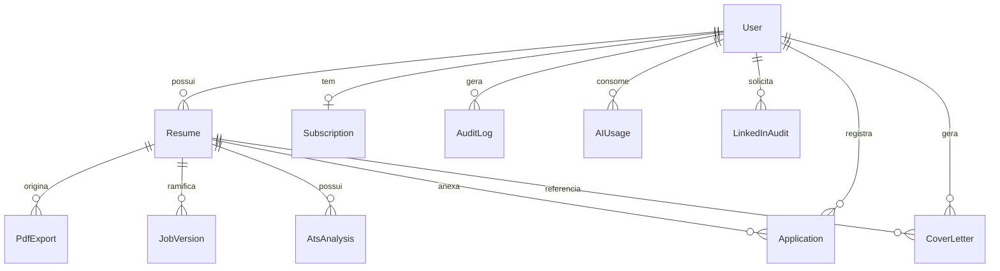

# Schema do Banco de Dados

> PostgreSQL via **Neon**, gerenciado por **Prisma 5**. Dados pessoais sensíveis
> criptografados em colunas com sufixo `_enc`. Conteúdo flexível em **JSONB**.

## Diagrama Entidade-Relacionamento



## Enums

```prisma
enum Plan        { FREE PRO }
enum SubStatus   { ACTIVE CANCELED PAST_DUE TRIALING }
enum AppStatus   { SAVED APPLIED REVIEWING INTERVIEW OFFER CLOSED }
enum AuditEvent  {
  LOGIN_OK  LOGIN_FAIL  LOGOUT  PWD_CHANGE
  MFA_ON  MFA_OFF
  RESUME_EXPORT  RESUME_DELETE  ACCOUNT_DELETE
  SUB_UPGRADE  SUB_CANCEL
  AI_CALL  PDF_GENERATE  LINKEDIN_AUDIT
}
enum AICallType  {
  ATS_SCORE  JOB_ADAPT  COVER_LETTER
  IMPROVE  SIMULATOR  LINKEDIN_AUDIT
}
```

## Tabelas

### `users`

| Coluna | Tipo | Descrição |
|---|---|---|
| `id` | String (cuid) | PK |
| `email` | String (unique) | Email de login (lookup) |
| `emailVerified` | Boolean | Confirmação obrigatória para editor |
| `name` | String? | Nome de exibição |
| `image` | String? | Avatar (URL R2) |
| `plan` | Plan | `FREE` ou `PRO` |
| `phone_enc` | String? | Telefone criptografado AES-256 |
| `mfaEnabled` | Boolean | MFA TOTP ativo |
| `mfaSecret_enc` | String? | Secret TOTP criptografado |
| `stripeCustomerId` | String? (unique) | ID do customer no Stripe |
| `linkedinUrl` | String? | URL do LinkedIn principal |
| `onboardingDone` | Boolean | Tour inicial concluído |
| `createdAt` / `updatedAt` | DateTime | Timestamps |

### `resumes`

| Coluna | Tipo | Descrição |
|---|---|---|
| `id` | String (cuid) | PK |
| `userId` | String | FK → User |
| `title` | String | "Meu CV — Desenvolvedor Pleno" |
| `slug` | String? (unique) | URL pública (Pro) |
| `isPublic` | Boolean | Visível publicamente? |
| `templateId` | String | `classic`, `modern`, `minimal`, ... |
| `colorScheme` | String | `blue`, `green`, `purple`, ... |
| `content` | Json (JSONB) | Estrutura flexível do currículo |
| `targetJob` | String? | Cargo-alvo declarado |
| `targetCompany` | String? | Empresa-alvo declarada |
| `atsScore` | Int? | Última nota ATS calculada |
| `completeness` | Int | % de completude (0–100) |
| `viewCount` | Int | Visualizações do link público |
| `downloadCount` | Int | Downloads de PDF |
| `createdAt` / `updatedAt` | DateTime | — |

#### Estrutura JSONB do campo `content`

```jsonc
{
  "personal": {
    "name": "", "email": "", "phone": "",
    "location": "", "linkedin": "", "github": "", "website": "",
    "jobTitle": "", "summary": "", "photoUrl": ""
  },
  "experience": [
    {
      "id": "cuid", "company": "", "role": "",
      "start": "2020-01", "end": "2023-12", "current": false,
      "description": "",
      "achievements": ["", ""]
    }
  ],
  "education": [
    {
      "id": "cuid", "institution": "", "course": "",
      "level": "GRAD", "start": "", "end": "", "description": ""
    }
  ],
  "skills": [
    { "id": "cuid", "name": "", "level": "intermediate" }
  ],
  "projects": [
    {
      "id": "cuid", "name": "", "description": "",
      "tech": ["", ""], "url": "", "github": ""
    }
  ],
  "languages": [
    { "id": "cuid", "language": "", "level": "advanced" }
  ],
  "certifications": [
    { "id": "cuid", "name": "", "issuer": "", "date": "", "url": "" }
  ],
  "awards": [
    { "id": "cuid", "title": "", "issuer": "", "date": "", "description": "" }
  ]
}
```

### `job_versions` (versões por vaga)

| Coluna | Tipo | Descrição |
|---|---|---|
| `id` | String (cuid) | PK |
| `resumeId` | String | FK → Resume (currículo base) |
| `jobTitle` | String | "Desenvolvedor Pleno" |
| `company` | String? | "Empresa X" |
| `jobDescription` | String | Texto completo colado da vaga |
| `adaptedContent` | Json | Conteúdo adaptado (mesma estrutura de `Resume.content`) |
| `atsScoreBefore` | Int? | ATS Score antes da adaptação |
| `atsScoreAfter` | Int? | ATS Score depois |
| `keywords` | Json | `{ present: [], missing: [], added: [] }` |
| `createdAt` | DateTime | — |

### `ats_analyses` (histórico)

| Coluna | Tipo | Descrição |
|---|---|---|
| `id` | String (cuid) | PK |
| `resumeId` | String | FK → Resume |
| `jobVersionId` | String? | FK → JobVersion (se específico) |
| `score` | Int | 0–100 |
| `breakdown` | Json | `{ keywords: 25, structure: 20, summary: 15, metrics: 15, skills: 15, formatting: 10 }` |
| `issues` | Json | `[{ category, severity, message, fix }]` |
| `keywords` | Json | `{ present: [], missing: [], recommended: [] }` |

### `linkedin_audits`

| Coluna | Tipo | Descrição |
|---|---|---|
| `id` | String (cuid) | PK |
| `userId` | String | FK → User |
| `profileUrl` | String | URL do perfil auditado |
| `profileData` | Json | Dados extraídos |
| `overallScore` | Int | 0–100 |
| `sectionScores` | Json | Por seção (foto, headline, about, ...) |
| `issues` | Json | Lista de problemas |
| `improvements` | Json | Sugestões concretas |
| `postIdeas` | Json | 5–10 ideias de post |
| `keywordsGap` | Json | Palavras-chave faltantes |
| `benchmarkData` | Json | Comparação com top 10% da área |
| `status` | String | `pending` \| `processing` \| `done` \| `failed` |

### `subscriptions`

| Coluna | Tipo | Descrição |
|---|---|---|
| `id` | String (cuid) | PK |
| `userId` | String (unique) | FK → User |
| `stripeSubscriptionId` | String (unique) | — |
| `stripePriceId` | String | — |
| `plan` | Plan | — |
| `status` | SubStatus | `ACTIVE`, `CANCELED`, ... |
| `currentPeriodStart` | DateTime | — |
| `currentPeriodEnd` | DateTime | — |
| `cancelAtPeriodEnd` | Boolean | — |
| `trialEnd` | DateTime? | — |

### `applications` (tracker Kanban)

| Coluna | Tipo | Descrição |
|---|---|---|
| `id` | String (cuid) | PK |
| `userId` | String | FK → User |
| `resumeId` | String? | FK → Resume (versão enviada) |
| `company` | String | — |
| `role` | String | — |
| `jobUrl` | String? | — |
| `status` | AppStatus | `SAVED` \| `APPLIED` \| `REVIEWING` \| `INTERVIEW` \| `OFFER` \| `CLOSED` |
| `appliedAt` | DateTime? | Data de candidatura |
| `salary` | String? | Faixa salarial |
| `notes` | String? | Notas livres |
| `contactName` | String? | — |
| `contactEmail` | String? | — |
| `nextStep` | String? | — |
| `nextStepAt` | DateTime? | — |

### `ai_usages` (controle de custo)

| Coluna | Tipo | Descrição |
|---|---|---|
| `id` | String (cuid) | PK |
| `userId` | String | FK → User |
| `type` | AICallType | Qual feature foi usada |
| `tokensUsed` | Int | Tokens consumidos |
| `costUsd` | Float | Custo em USD |
| `metadata` | Json? | `{ resumeId, jobVersionId, ... }` |

### `audit_logs` (trilha de auditoria)

| Coluna | Tipo | Descrição |
|---|---|---|
| `id` | String (cuid) | PK |
| `userId` | String? | FK → User (nullable para tentativas falhas) |
| `event` | AuditEvent | Tipo de evento |
| `metadata` | Json? | Dados contextuais |
| `ip` | String? | — |
| `userAgent` | String? | — |
| `success` | Boolean | true / false |

### `cover_letters`

| Coluna | Tipo | Descrição |
|---|---|---|
| `id` | String (cuid) | PK |
| `userId` | String | FK → User |
| `resumeId` | String? | FK → Resume |
| `jobTitle` | String | — |
| `company` | String? | — |
| `jobDescription` | String? | — |
| `tone` | String | `formal` \| `direct` \| `creative` |
| `language` | String | `pt-BR` \| `en` |
| `content` | String | Texto da carta |
| `createdAt` | DateTime | — |

### `pdf_exports`

| Coluna | Tipo | Descrição |
|---|---|---|
| `id` | String (cuid) | PK |
| `resumeId` | String | FK → Resume |
| `userId` | String | FK → User |
| `templateId` | String | Template usado |
| `colorScheme` | String | Cor usada |
| `fileKey` | String | Chave no R2 |
| `fileSize` | Int | Bytes |
| `watermark` | Boolean | Marca d'água do Free? |
| `expiresAt` | DateTime? | URL assinada expira em 24h |

## Estratégia de Criptografia

| Campo | Algoritmo | Motivo |
|---|---|---|
| `User.password` | bcrypt (rounds 12) | Hash unidirecional — padrão |
| `User.phone_enc` | AES-256-GCM (reversível) | LGPD, necessário exibir |
| `User.mfaSecret_enc` | AES-256-GCM | Comprometido = acesso à conta |
| `Resume.content` | Sem criptografia | Dado do usuário, RLS no Neon |
| `LinkedInAudit.profileData` | Sem criptografia + TTL 90d | Descartado após auditoria |

> Chave AES-256 armazenada em `process.env.ENCRYPTION_KEY` (32 bytes hex),
> rotacionável via double-encryption durante migração.
