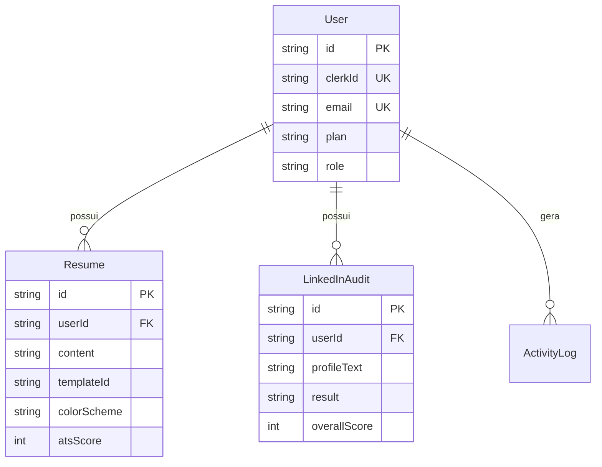

# Modelo de dados

O schema Prisma está em `prisma/schema.prisma` e usa PostgreSQL. Não há entidades separadas para versões de currículo, candidaturas, links públicos, histórico ATS ou assinaturas: esses recursos não estão modelados na implementação atual.

```mermaid
erDiagram
  User ||--o{ Resume : possui
  User ||--o{ LinkedInAudit : possui
  User ||--o{ ActivityLog : gera
  User {
    string id PK
    string clerkId UK
    string email UK
    string plan
    string role
  }
  Resume {
    string id PK
    string userId FK
    string content
    string templateId
    string colorScheme
    int atsScore
  }
  LinkedInAudit {
    string id PK
    string userId FK
    string profileText
    string result
    int overallScore
  }
```

## Entidades

| Entidade | Finalidade | Campos relevantes |
|---|---|---|
| `User` | Conta local vinculada ao Clerk | plano, papel, preferências, consumo mensal de IA e IDs Stripe |
| `Resume` | Currículo de um usuário | título, conteúdo JSON serializado, template, estilo e última nota ATS |
| `LinkedInAudit` | Histórico de auditoria | texto de origem, contexto, nota e resultado JSON serializado |
| `ActivityLog` | Registro de ações | usuário, ação, detalhes, IP e user agent |
| `ProcessedEvent` | Idempotência Stripe | ID e tipo do evento já tratado |

## Regras de integridade

- `email`, `clerkId`, `stripeCustomerId` e `stripeSubscriptionId` são únicos quando presentes.
- `Resume`, `LinkedInAudit` e `ActivityLog` pertencem a `User` e são apagados por cascade na exclusão da conta.
- `Resume.content` e `LinkedInAudit.result` são strings JSON; cada leitura precisa tratar falhas de parse de forma defensiva.
- O plano é persistido como string. A normalização e os limites ativos estão em `lib/plan.ts` (`FREE`, `PRO` e `MAX`).

## Migrações

Use `npm run db:generate` para gerar o cliente Prisma e `npm run db:migrate` para criar migrações. Evite editar manualmente a pasta `prisma/migrations/`.