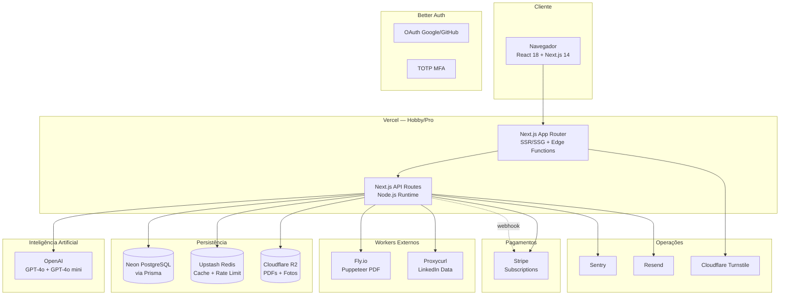

# Arquitetura — Visão Geral

> Documento vivo. Última atualização refletindo o **Planejamento v3.0** do ATRION.

## 1. Visão Técnica Geral

O ATRION é construído como uma **aplicação monolítica modular em Next.js 14**, integrando serviços externos especializados para cada responsabilidade. A arquitetura prioriza **custo zero na fase inicial** com **escala horizontal na fase de crescimento**.

### 1.1 Princípios Arquiteturais

| # | Princípio | Descrição |
|---|---|---|
| 1 | **Monorepo First** | Frontend + backend + types no mesmo repositório — zero overhead de sincronização de contratos |
| 2 | **Serverless by Default** | Sem servidor dedicado até atingir escala que justifique o custo |
| 3 | **Pay-as-you-go** | Todos os serviços com free tier ou cobrança por uso — custo zero antes do primeiro usuário |
| 4 | **Type Safety End-to-End** | Schemas Zod compartilhados entre frontend e API, tipos Prisma no banco |
| 5 | **Offline-First no Editor** | Estado local com Zustand + sync para o servidor a cada 2s (debounce) |

### 1.2 Diagrama de Camadas

## 2. Camadas de Responsabilidade

| Camada | Responsabilidade | Tecnologia | Hosting |
|---|---|---|---|
| Apresentação | UI, routing, SSR/SSG | Next.js 14 App Router | Vercel |
| Estado cliente | Cache local, editor state | Zustand + React Query | Browser |
| API | Endpoints REST, validação | Next.js API Routes | Vercel Functions |
| Autenticação | Sessões, OAuth, MFA | Better Auth | Vercel + Neon |
| Banco de dados | Persistência principal | PostgreSQL via Neon | Neon (serverless) |
| Cache / Rate limit | Performance, proteção | Redis via Upstash | Upstash (serverless) |
| IA — Currículos | ATS, adaptação, melhoria | OpenAI GPT-4o mini | OpenAI API |
| IA — LinkedIn | Auditoria de perfil | OpenAI GPT-4o | OpenAI API |
| PDF | Geração de alta qualidade | Puppeteer | Fly.io |
| Storage | Arquivos, PDFs, fotos | Cloudflare R2 | Cloudflare |
| Email | Transacional + marketing | Resend | Resend |
| Pagamentos | Assinaturas, webhooks | Stripe | Stripe |
| Monitoramento | Erros, performance | Sentry + Vercel Analytics | Sentry / Vercel |

## 3. Decisões Arquiteturais Chave

### ADR-001: Monolito modular em Next.js
- **Decisão:** App monolítica em Next.js 14 ao invés de microsserviços.
- **Motivo:** Equipe solo + IA. Menor overhead operacional. Type safety compartilhado. Deploy único.
- **Consequência:** Vantagens de DX e velocidade. Trade-off: precisa disciplina modular (boundaries claros em `lib/`, `components/`, `app/(app)/`).

### ADR-002: Puppeteer no Fly.io ao invés de @react-pdf
- **Decisão:** Geração de PDF via Puppeteer (HTML→PDF) como caminho principal, com `@react-pdf/renderer` apenas como fallback.
- **Motivo:** Suporte completo a CSS, gradientes, layouts complexos, fontes customizadas. Templates mais bonitos e fiéis.
- **Consequência:** Necessário worker separado (Fly.io, 256MB free tier) e fila (Upstash QStash) para não bloquear a API.

### ADR-003: Better Auth ao invés de NextAuth
- **Decisão:** Substituir NextAuth.js v5 por Better Auth.
- **Motivo:** API mais limpa, tipagem TypeScript nativa, MFA TOTP nativo, integra direto com Prisma, sem beta instável.
- **Consequência:** Stack mais nova, mas com manutenção ativa e padrão emergente no ecossistema.

### ADR-004: Estratégia em camadas para LinkedIn scraping
- **Decisão:** Input manual no V1 → Proxycurl no V2 → LinkedIn API oficial no V3.
- **Motivo:** LinkedIn bloqueia scrapers ativamente. Reduzir risco técnico no MVP.
- **Consequência:** UX exige "colar texto" no início, mas isso vira "isca" de marketing ("como copiar seu perfil").

### ADR-005: Abstração de provedor de IA
- **Decisão:** Interface genérica `aiClient.complete(prompt)` desde o V1.
- **Motivo:** Evitar lock-in com OpenAI. Permite fallback para Groq (Llama 3.3) em features não-críticas.
- **Consequência:** Custo de setup inicial, mas flexibilidade para negociar preço ou trocar provedor.

## 4. Modelo de Deploy

| Ambiente | Frontend + API | Worker Puppeteer | Banco |
|---|---|---|---|
| **Local** | `next dev` | Docker | Postgres via Docker ou branch Neon dev |
| **Preview (PR)** | Vercel Preview Deploys | Fly.io staging | Neon branch por PR |
| **Produção** | Vercel Pro (escala V3+) | Fly.io 1–2 instâncias | Neon Pro (escala V3+) |

## 5. Modelo de Escala

| Fase | Usuários | Estratégia |
|---|---|---|
| V1 | 0–100 | Serverless completo. Sem otimização. |
| V2 | 100–1.000 | Cache de prompts repetidos. Fila Puppeteer dimensionada. |
| V3 | 1k–5k | Neon Pro. Vercel Pro. Considerar Redis cluster. |
| V4 | 5k+ | CDN agressivo para templates. Sentry Pro. Workers Puppeteer em pool. |

## 6. Referências

- Stack detalhado → [`tech-stack.md`](./tech-stack.md)
- Schema do banco → [`database-schema.md`](./database-schema.md)
- Estrutura de pastas → [`folder-structure.md`](./folder-structure.md)
- Segurança → [`security.md`](./security.md)
- Design system → [`design-system.md`](./design-system.md)
