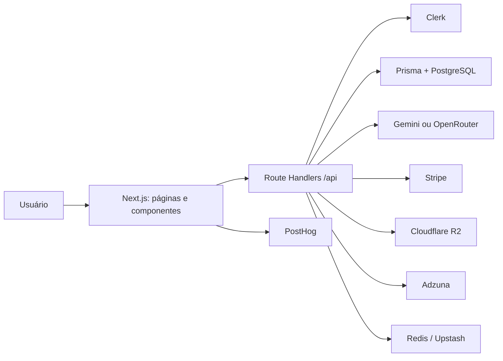

# Arquitetura: visão atual

O ATRION é um monólito modular em Next.js. Interface, rotas HTTP, regras de negócio e acesso a dados vivem no mesmo repositório e são integrados a serviços especializados para autenticação, IA, pagamentos, arquivos, vagas e telemetria.

```mermaid
flowchart LR
  U[Usuário] --> N[Next.js: páginas e componentes]
  N --> A[Route Handlers /api]
  A --> C[Clerk]
  A --> P[Prisma + PostgreSQL]
  A --> I[Gemini ou OpenRouter]
  A --> S[Stripe]
  A --> R[Cloudflare R2]
  A --> J[Adzuna]
  A --> L[Redis / Upstash]
  N --> T[PostHog]
```

## Camadas

| Camada | Responsabilidade | Local principal |
|---|---|---|
| Rotas e páginas | Navegação, SSR e endpoints | `app/` |
| Interface | Editor, templates e UI | `components/` |
| Domínio e integrações | Auth, IA, planos, dados, rate limit | `lib/` |
| Persistência | Usuários, currículos, auditorias e logs | `prisma/` |
| Qualidade | Testes unitários e E2E | `tests/` |

## Decisões em vigor

- O Clerk é o provedor de autenticação. O banco mantém um usuário espelhado por `clerkId` para regras de plano e dados do produto.
- O currículo e o resultado da auditoria são JSON serializados. Isso permite evoluir o formato do editor sem migration para cada campo.
- A camada `lib/ai.ts` escolhe Gemini nativo quando disponível e usa OpenRouter como alternativa.
- As cotas mensais de IA são controladas no banco com incremento condicional, evitando consumo duplicado em requisições concorrentes.
- PDFs são exportados pela interface do navegador. Não há worker Puppeteer ou fila de geração no código atual.

## Limites atuais

O projeto não implementa, neste momento, tracker de candidaturas, currículo público, carta de apresentação, simulador de recrutador, MFA próprio, fila de PDF ou API pública. Esses temas podem aparecer em documentos de planejamento, mas não devem ser tratados como funcionalidades ativas.