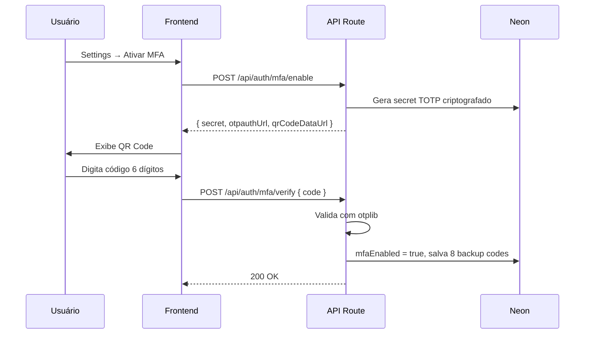

# Segurança

> Nível de **produção comercial**. Cobre autenticação, autorização, criptografia,
> rate limiting, headers HTTP, auditoria, backup e conformidade LGPD.

## 1. Autenticação (Better Auth)

| Camada | Implementação | Detalhe |
|---|---|---|
| **Senha** | bcrypt rounds 12 | Hash unidirecional, nunca armazenado em texto puro |
| **Sessão** | JWT HS256 + refresh rotativo | Expiração 30 dias, refresh automático, revogação por userId |
| **OAuth** | Google + GitHub | Delegado ao provider, sem senha armazenada |
| **MFA TOTP** | otplib + qrcode | Google Authenticator / Authy, QR Code na ativação, 8 códigos de backup |
| **Verificação email** | Código 6 dígitos, 15min TTL | Obrigatório para acessar o editor, reenviável |
| **Recuperação senha** | Token único, 1h TTL | Enviado via Resend, invalidado após uso |

### Fluxo de ativação MFA



## 2. Anti-Bot (Cloudflare Turnstile)

Substitui reCAPTCHA: sem fricção para o usuário, mais eficaz contra bots, **gratuito sem limites**.

Aplicado em:
- Cadastro de conta
- Login
- Reset de senha
- Formulário de contato
- Auditoria LinkedIn (V2+)

## 3. Rate Limiting Granular (Upstash Redis)

| Endpoint | Algoritmo | Limite | Penalidade |
|---|---|---|---|
| `POST /api/auth/*` | Fixed Window / Sliding Window | Varia | Bloquear IP temporariamente |
| `POST /api/ai/*` | Sliding Window | 5 chamadas / minuto por userId | HTTP 429 + `Retry-After` |
| `POST /api/upload/*` | Sliding Window | 10 req / minuto por userId | HTTP 429 |
| `GET /api/jobs` | Sliding Window | 30 req / minuto por userId | HTTP 429 |
| `POST /api/stripe/checkout`| Sliding Window | 3 req / minuto por userId | HTTP 429 |
| `POST /api/stripe/webhook`| — | Ilimitado | Verificação de assinatura Stripe |
| API Geral / CRUD | Sliding Window | 30 req / minuto por userId | HTTP 429 |

## 4. Headers HTTP de Segurança

Aplicados em **todas** as rotas via `next.config.mjs`:

- `X-Content-Type-Options: nosniff`
- `X-Frame-Options: DENY`
- `X-XSS-Protection: 1; mode=block`
- `Referrer-Policy: strict-origin-when-cross-origin`
- `Permissions-Policy: camera=(), microphone=(), geolocation=()`
- `Strict-Transport-Security: max-age=31536000; includeSubDomains`
- `Content-Security-Policy`:
  - `default-src 'self'`
  - `script-src` / `style-src`: Permite `unsafe-inline`, `js.stripe.com`, `clerk.accounts.dev`
  - `img-src`: Permite blob, data, Cloudflare R2, LinkedIn media, Clerk.
  - `connect-src`: Stripe, Clerk, Adzuna, OpenRouter AI.
  - `frame-src`: Stripe, Clerk.

## 4.1. Prevenção de XSS e Vazamentos

- Renderização de conteúdo de terceiros (como vagas da Adzuna) passa por um utilitário `stripHtml`, prevenindo XSS via `dangerouslySetInnerHTML`.
- Erros internos detalhados gerados por libs (como pdf-parse) não são expostos em JSON no ambiente de produção.
- Rotas de visualização de arquivos via R2 (`/api/files/[...key]`) validam a autenticação da sessão e propriedade (`ownership`) conferindo se o UUID da pasta pertence ao usuário.

## 5. Criptografia de Dados Pessoais

```ts
// lib/crypto.ts
import { createCipheriv, createDecipheriv, randomBytes } from 'crypto';

const KEY = Buffer.from(process.env.ENCRYPTION_KEY!, 'hex'); // 32 bytes

export function encrypt(text: string): string {
  const iv = randomBytes(12);
  const cipher = createCipheriv('aes-256-gcm', KEY, iv);
  const encrypted = Buffer.concat([cipher.update(text, 'utf8'), cipher.final()]);
  const tag = cipher.getAuthTag();
  return [iv, encrypted, tag].map(b => b.toString('hex')).join(':');
}

export function decrypt(payload: string): string {
  const [ivHex, encHex, tagHex] = payload.split(':');
  const decipher = createDecipheriv('aes-256-gcm', KEY, Buffer.from(ivHex, 'hex'));
  decipher.setAuthTag(Buffer.from(tagHex, 'hex'));
  return Buffer.concat([
    decipher.update(Buffer.from(encHex, 'hex')),
    decipher.final()
  ]).toString('utf8');
}
```

> Rotação de chave possível via **double-encryption** durante migração
> (criptografa com chave nova + mantém criptografia antiga por janela de transição).

### Mascaramento de PII em Prompts

Todos os envios de currículo para modelos de IA através da API (como Análise ou Adaptação) realizam mascaramento de Identificadores Pessoais (PII). Campos sensíveis, como E-mail e Telefone, são previamente omitidos pelo backend para evitar vazamento em logs de provedores (ex: OpenRouter / OpenAI).

## 6. Trilha de Auditoria

Todas as ações críticas registradas em `audit_logs`:

```prisma
model AuditLog {
  id        String     @id @default(cuid())
  userId    String?
  event     AuditEvent
  metadata  Json?
  ip        String?
  userAgent String?
  success   Boolean    @default(true)
  createdAt DateTime   @default(now())
}
```

Eventos rastreados:
- `LOGIN_OK`, `LOGIN_FAIL`, `LOGOUT`
- `PWD_CHANGE`, `MFA_ON`, `MFA_OFF`
- `RESUME_EXPORT`, `RESUME_DELETE`, `ACCOUNT_DELETE`
- `SUB_UPGRADE`, `SUB_CANCEL`
- `AI_CALL`, `PDF_GENERATE`, `LINKEDIN_AUDIT`

## 7. Estratégia de Backup

| Recurso | Frequência | Retenção | Ferramenta |
|---|---|---|---|
| PostgreSQL (Neon) | Automático contínuo (PITR) | 7 dias Free / 30 dias Pro | Neon built-in |
| PostgreSQL (manual) | pg_dump semanal via cron | 4 semanas em R2 (bucket separado) | Fly.io cron job |
| Cloudflare R2 (PDFs) | Sincronização semanal | 30 dias em bucket de backup | rclone sync |
| Código-fonte | Push contínuo | Histórico completo | GitHub (privado) |
| Variáveis de ambiente | A cada alteração | Versão em Vault | Doppler ou 1Password |

## 8. Checklist de Segurança para Go-Live

| Item | Versão alvo | Status |
|---|---|---|
| HTTPS em todos os endpoints | V1 | ✅ Vercel garante |
| Security headers (CSP, HSTS, ...) | V1 | 🔨 Implementar no middleware |
| Rate limiting por endpoint | V1 | 🔨 Upstash Redis |
| Validação de input (Zod) em toda API | V1 | 🔨 Em todos os routes |
| Cloudflare Turnstile no cadastro/login | V1 | 🔨 Integrar |
| Senhas com bcrypt (salt 12) | V1 | ✅ Better Auth built-in |
| JWT com expiração adequada | V1 | ✅ Better Auth config |
| Auditoria de ações críticas | V2 | 🔨 Tabela `AuditLog` |
| MFA (TOTP) | V2 | 🔨 Better Auth plugin |
| Criptografia AES-256 dados pessoais | V2 | 🔨 `lib/crypto.ts` |
| Backup diário do banco | V2 | 🔨 Neon built-in + pg_dump |
| Backup semanal do storage | V2 | 🔨 Script no Fly.io |
| Penetration test básico | V3 | ⏳ OWASP ZAP ou similar |
| LGPD: política de privacidade | Lançamento | ⏳ Redigir com advogado |
| LGPD: endpoint de exclusão de dados | Lançamento | ⏳ `DELETE /api/users/me` |
| LGPD: consentimento explícito marketing | Lançamento | ⏳ Checkbox no cadastro |
| DPO definido + email de contato | Lançamento | ⏳ `privacy@cvforge.com.br` |

## 9. Resposta a Incidentes

> Processo a documentar antes do lançamento público.

1. **Detecção** — Sentry alerta + rate de erros anômalo
2. **Contenção** — Desabilitar feature / bloquear IPs / revogar tokens
3. **Erradicação** — Patch + rotação de chaves afetadas
4. **Recuperação** — Restore de backup Neon / R2
5. **Notificação** — ANPD em até **72h** (LGPD Art. 48) + comunicação aos usuários afetados
6. **Post-mortem** — Documento público + melhorias implementadas

## 10. Referências

- [LGPD — Lei nº 13.709/2018](https://www.planalto.gov.br/ccivil_03/_ato2015-2018/2018/lei/l13709.htm)
- [OWASP Top 10](https://owasp.org/www-project-top-ten/)
- ADR-001 → ADR-005 em [`overview.md`](./overview.md)
