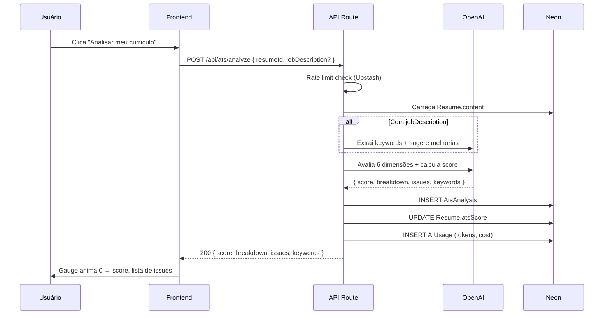

# ATS Score

> A **feature de maior valor percebido** do ATRION. Analisa o currículo e gera
> uma pontuação 0–100 baseada em critérios reais de sistemas ATS (Applicant
> Tracking System) usados por empresas.

## Visão Geral

| Aspecto | Detalhe |
|---|---|
| **Tela** | `app/(app)/ats/[id]/page.tsx` |
| **Componente** | `components/ats/` |
| **API** | `POST /api/ats/analyze` |
| **IA** | OpenAI GPT-4o mini (V1) + keyword extraction local |
| **Schema DB** | `AtsAnalysis` (histórico) |

## Dimensões de Pontuação

| Dimensão | Peso | Como é calculada |
|---|:---:|---|
| **Palavras-chave da vaga** | 25% | Match com keywords da descrição (variações: React / ReactJS / React.js) |
| **Estrutura do documento** | 20% | Seções obrigatórias, títulos reconhecíveis, ausência de tabelas complexas |
| **Resumo profissional** | 15% | Comprimento (3–6 linhas), cargo-alvo, ≥ 2 verbos de ação, anos de experiência |
| **Métricas e resultados** | 15% | Presença de números, %, R$, quantidades nas descrições |
| **Habilidades técnicas** | 15% | Match com requisitos da vaga (obrigatórios vs. diferenciais) |
| **Formatação e legibilidade** | 10% | Sem tabelas complexas, imagens, colunas múltiplas, headers/footers críticos |

**Total = 100 pontos**

## Dois Modos de Análise

### Modo 1 — Geral (V1, Free)
- Avalia o currículo **sem** uma vaga específica
- Foco em: estrutura, completude, métricas, comprimento, formatação
- Free: 3 análises/mês | Pro: ilimitado

### Modo 2 — Por Vaga (V2, Pro)
- Usuário cola a descrição da vaga
- IA extrai keywords obrigatórias e diferenciais
- Match com o conteúdo do currículo
- Recomenda palavras-chave a adicionar
- Cria automaticamente uma `JobVersion` ao adaptar

## Fluxo de Análise



## Estrutura do Output (JSON)

```ts
interface AtsAnalysisResult {
  score: number;          // 0-100
  mode: 'general' | 'job-specific';
  jobTitle?: string;
  company?: string;

  breakdown: {
    keywords:     { score: number; max: 25; feedback: string };
    structure:    { score: number; max: 20; feedback: string };
    summary:      { score: number; max: 15; feedback: string };
    metrics:      { score: number; max: 15; feedback: string };
    skills:       { score: number; max: 15; feedback: string };
    formatting:   { score: number; max: 10; feedback: string };
  };

  issues: AtsIssue[];

  keywords: {
    present:     string[];
    missing:     string[];
    recommended: string[];
  };

  suggestions: string[];   // Top 5 ações
}

interface AtsIssue {
  category: 'keywords' | 'structure' | 'summary' | 'metrics' | 'skills' | 'formatting';
  severity: 'critical' | 'warning' | 'info';
  message: string;
  fix: string;             // Como resolver
}
```

## Exemplo de UI

```
┌─────────────────────────────────────────────────────────────┐
│  ATS Score Geral                                            │
│  Última análise: 12/06/2026 às 14:32                        │
├─────────────────────────────────────────────────────────────┤
│                                                             │
│                     ╭─────────╮                             │
│                     │   78    │   ← gauge animado           │
│                     │  / 100  │                             │
│                     ╰─────────╯                             │
│                                                             │
│  ┌─────────────┬─────────────┬─────────────┐                │
│  │ Palavras-ch.│ Estrutura   │ Resumo      │                │
│  │ 22 / 25  🟢 │ 18 / 20  🟢 │ 10 / 15  🟡 │                │
│  ├─────────────┼─────────────┼─────────────┤                │
│  │ Métricas    │ Habilidades │ Formatação  │                │
│  │  8 / 15  🟡 │ 13 / 15  🟢 │  7 / 10  🟢 │                │
│  └─────────────┴─────────────┴─────────────┘                │
│                                                             │
│  Issues (4)                                                 │
│  ┌─────────────────────────────────────────────────────┐    │
│  │ 🔴 Crítico — Poucas palavras-chave técnicas        │    │
│  │    Adicione: React, TypeScript, Node.js, AWS       │    │
│  │    [→ Adicionar ao editor]                         │    │
│  ├─────────────────────────────────────────────────────┤    │
│  │ 🟡 Alerta — Resumo muito curto (2 linhas)          │    │
│  │    Expanda para 3-6 linhas mencionando seu cargo   │    │
│  │    [✨ Sugerir resumo com IA] (Pro)                 │    │
│  ├─────────────────────────────────────────────────────┤    │
│  │ 🟡 Alerta — Experiências sem métricas              │    │
│  │    Adicione números: "reduzi tempo em 40%"         │    │
│  └─────────────────────────────────────────────────────┘    │
│                                                             │
│  Palavras-chave                                             │
│  ┌────────────────┬────────────────┬────────────────┐       │
│  │ Presentes (8)  │ Faltantes (5)  │ Recomendadas(4)│       │
│  │ ✓ React        │ ✗ TypeScript   │ + Docker       │       │
│  │ ✓ Node.js      │ ✗ AWS          │ + CI/CD        │       │
│  │ ✓ JavaScript   │ ✗ PostgreSQL   │ + GraphQL      │       │
│  └────────────────┴────────────────┴────────────────┘       │
│                                                             │
│  [✨ Adaptar currículo para esta vaga] (Pro)                │
└─────────────────────────────────────────────────────────────┘
```

## Lógica de Scoring (sem IA — para fallback)

Para um scoring **local** sem custo de IA, usado como pré-filtro:

```ts
function calculateLocalScore(content: ResumeContent): Partial<AtsScore> {
  const { personal, experience, skills } = content;

  let metrics = 0;
  for (const exp of experience) {
    const hasNumber = /\d+%|\d+ anos?|R\$ ?\d+/.test(exp.description);
    if (hasNumber) metrics += 5;
    if (exp.achievements.length > 0) metrics += 3;
  }

  let summary = 0;
  if (personal.summary.length >= 150) summary += 8;
  if (personal.summary.includes(personal.jobTitle)) summary += 4;
  if (/\b(anos|experience|experiência)\b/i.test(personal.summary)) summary += 3;

  let skillsScore = 0;
  if (skills.length >= 5) skillsScore += 8;
  if (skills.length >= 10) skillsScore += 7;

  return { metrics, summary, skills: skillsScore };
}
```

> A IA roda **apenas** para validar e complementar o scoring local.

## Histórico de Análises

Cada análise gera um registro `AtsAnalysis`. Gráfico de evolução:

```
Score
  100 ┤
   80 ┤        ●───●
   60 ┤  ●───●        ●
   40 ┤●
      └─────────────────────
       Jan  Fev  Mar  Abr
```

## Rate Limiting

| Plano | Limite | Janela |
|---|---|---|
| Free | 3 análises | Mês (por usuário) |
| Pro | Ilimitado | — |
| Pro Anual | Ilimitado | — |

> Geral ou por vaga conta no mesmo balde. Implementação em `lib/rate-limit.ts` com chave `ats:${userId}:${currentMonth}`.

## Edge Cases

1. **Currículo vazio** → 400 Bad Request com mensagem "Adicione dados pessoais antes"
2. **Score < 30** → UI mostra "Precisa de atenção" + checklist de primeiros passos
3. **Score > 90** → confetti animation + sugestão de compartilhar
4. **IA retorna JSON inválido** → retry com `temperature: 0.1`, fallback para scoring local
5. **Job description > 10k chars** → truncar para 8k + avisar usuário
6. **Custo da IA excede limite do usuário** → 402 Payment Required (Pro free trial acabou)

## Métricas de Sucesso

| Métrica | Meta V1 | Meta V3 |
|---|:---:|:---:|
| % de usuários Pro que usam ATS Score | > 70% | > 90% |
| Score médio do primeiro currículo | < 50 | < 60 |
| Aumento médio após adaptação | +15 pontos | +20 pontos |
| Conversão Free → Pro após usar | > 5% | > 10% |
