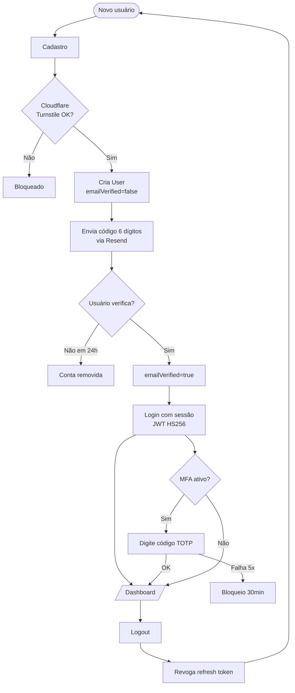

# Autenticação e Conta

> Sistema de autenticação com **email/senha**, **OAuth** (Google + GitHub),
> **verificação de email obrigatória** e **MFA TOTP opcional**.

## Visão Geral

| Aspecto | Detalhe |
|---|---|
| **Provider** | Better Auth |
| **Telas** | `app/(auth)/` |
| **Handlers API** | `app/api/auth/[...all]/route.ts` |
| **Schema DB** | `User`, `Session`, `Account`, `Verification` (Better Auth) |
| **OAuth** | Google + GitHub |
| **MFA** | TOTP (otplib + qrcode) |

## Fluxos de Autenticação



## Cadastro

**Campos obrigatórios:**
- Nome
- Email (único)
- Senha (≥ 8 chars, ≥ 1 número, ≥ 1 maiúscula)
- Aceite de Termos de Uso (checkbox)
- Consentimento de marketing (checkbox separado — não bundled)
- Cloudflare Turnstile (invisível)

**Validações (Zod):**
```ts
const signupSchema = z.object({
  name: z.string().min(2).max(100),
  email: z.string().email().toLowerCase(),
  password: z.string()
    .min(8, 'Mínimo 8 caracteres')
    .regex(/[A-Z]/, 'Ao menos 1 maiúscula')
    .regex(/[0-9]/, 'Ao menos 1 número'),
  acceptTerms: z.literal(true, { errorMap: () => ({ message: 'Aceite os termos' }) }),
  marketingConsent: z.boolean().default(false),
  turnstileToken: z.string(),
});
```

**Rate limit:** 10 cadastros/hora por IP.

## Login

**Opções:**
1. Email + senha
2. Google OAuth
3. GitHub OAuth

**Rate limit:** 5 tentativas/15min por IP+email → bloqueio 30min.

**Após login bem-sucedido:**
- Sessão JWT HS256 (30 dias, refresh rotativo)
- Cookie httpOnly + Secure + SameSite=Lax
- Audit log: `LOGIN_OK` ou `LOGIN_FAIL` com metadata

## Verificação de Email

- Código 6 dígitos, TTL 15min, reenviável
- **Obrigatório** para acessar o editor (criar/editar currículo)
- Templates React Email: `emails/verify-email.tsx`

## Recuperação de Senha

- Token único, TTL 1h, invalidado após uso
- Email com link: `cvforge.com.br/reset-password?token=...`
- Template: `emails/reset-password.tsx`

## MFA (TOTP)

### Ativação

1. Settings → Segurança → "Ativar autenticação em dois fatores"
2. Sistema gera secret TOTP (32 chars base32) criptografado
3. QR Code gerado com `qrcode` (otpauth:// URL)
4. Usuário escaneia com Google Authenticator / Authy
5. Usuário digita código de 6 dígitos para confirmar
6. Sistema gera 8 códigos de backup (single-use)
7. `mfaEnabled = true`

### Uso no Login

1. Usuário loga com email/senha
2. Sistema detecta `mfaEnabled = true` → redireciona para `/mfa`
3. Usuário digita código TOTP (ou código de backup)
4. Verificação OK → sessão criada

### Códigos de Backup

- 8 códigos alfanuméricos de 8 caracteres
- Single-use, armazenados com hash bcrypt
- Usuário pode regenerar (revoga os antigos)
- Mostrados **uma única vez** na ativação

### Obrigatoriedade

| Ação | MFA obrigatório? |
|---|:---:|
| Login normal | ❌ (opcional) |
| Excluir conta | ✅ |
| Alterar email | ✅ |
| Exportar todos os currículos | ✅ |
| Alterar plano | ❌ (vai para Stripe) |
| Gerar API token (V4+) | ✅ |

## OAuth (Google + GitHub)

- Configurado em Better Auth
- Sem senha armazenada para contas OAuth
- Email vem do provider, mas `emailVerified = true` por padrão (provider garante)
- Avatar sincronizado do provider (a menos que o usuário faça upload)

## Segurança

| Camada | Implementação |
|---|---|
| Senha | bcrypt rounds 12 |
| Sessão | JWT HS256 + refresh rotativo, expiração 30d |
| Cookie | httpOnly, Secure, SameSite=Lax |
| CSRF | Better Auth gerencia automaticamente |
| Anti-bot | Turnstile em cadastro, login, reset |
| Rate limit | Upstash Redis por endpoint |

## Schema (Better Auth)

```prisma
model User {
  id            String    @id @default(cuid())
  email         String    @unique
  emailVerified Boolean   @default(false)
  name          String?
  image         String?
  // campos extras do ATRION:
  plan          Plan      @default(FREE)
  mfaEnabled    Boolean   @default(false)
  mfaSecret_enc String?
  // ...
  accounts      Account[]
  sessions      Session[]
}

model Account {
  // OAuth providers vinculados
  id                String  @id @default(cuid())
  userId            String
  providerId        String  // 'google' | 'github' | 'credential'
  accountId         String
  accessToken       String?
  refreshToken      String?
  expiresAt         DateTime?
  password          String? // hash bcrypt (apenas credential)
  user              User    @relation(...)
}

model Session {
  id        String   @id @default(cuid())
  userId    String
  token     String   @unique
  expiresAt DateTime
  ipAddress String?
  userAgent String?
  user      User     @relation(...)
}

model Verification {
  id         String   @id @default(cuid())
  identifier String   // email
  value      String   // código ou token
  expiresAt  DateTime
}
```

## LGPD — Direitos do Usuário

| Direito | Endpoint |
|---|---|
| Acesso aos dados | `GET /api/users/me/data` (JSON) |
| Portabilidade | `GET /api/users/me/export` (JSON) |
| Exclusão | `DELETE /api/users/me` (soft delete 30d) |
| Revogação marketing | `PATCH /api/users/me` `{ marketingConsent: false }` |
| Log de consentimento | Tabela `audit_logs` com `metadata.consentVersion` |

> Mais detalhes em [`/docs/architecture/security.md`](../architecture/security.md).
