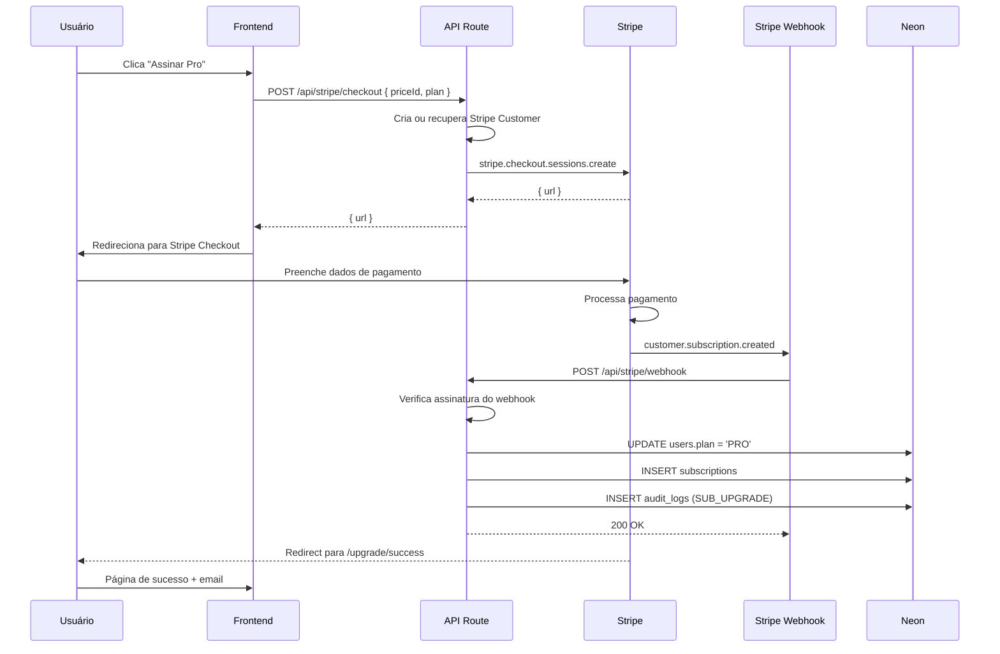
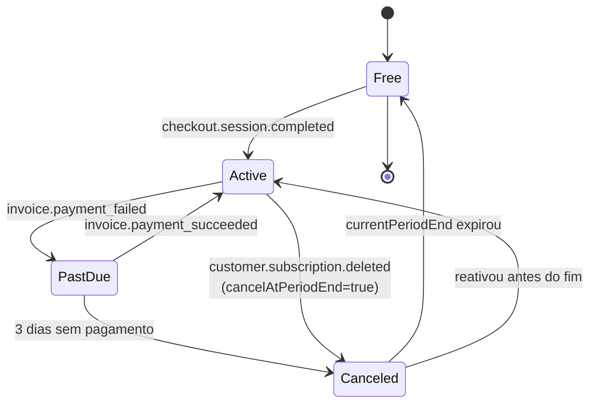

# Billing — Planos, Checkout e Webhooks

> Integração com **Stripe** para assinaturas dos planos Pro Mensal e Pro Anual.
> Free é o default, sem cobrança.

## Planos

| Plano | Preço | Cobrança | Equivalente diário | Stripe Price ID |
|---|---|---|---|---|
| **Free** | R$ 0 | — | — | — |
| **Pro Mensal** | R$ 29/mês | Mensal | R$ 0,97/dia | `STRIPE_PRICE_ID_PRO_MONTHLY` |
| **Pro Anual** | R$ 197/ano | Anual (32% off) | R$ 0,54/dia | `STRIPE_PRICE_ID_PRO_ANNUAL` |
| **Times** (futuro) | R$ 99/usuário/mês | Mensal | — | A definir |

> **Benchmark:** Zety US$5,99/semana (≈R$120/mês). Resume.io US$2,95/semana
> (≈R$60/mês). ATRION a R$29/mês é **4x mais barato** que Zety.

## Matriz de Funcionalidades × Plano

Veja [`/docs/features/README.md`](./README.md#matriz-de-funcionalidades--plano).

## Fluxo de Upgrade



## Endpoints

### `POST /api/stripe/checkout`

Cria sessão de checkout e retorna URL.

```ts
// Request
{ priceId: 'monthly' | 'annual' }

// Response
{ url: 'https://checkout.stripe.com/...' }
```

### `POST /api/stripe/webhook`

Recebe eventos do Stripe. **Verifica assinatura obrigatoriamente.**

```ts
// Eventos tratados
- checkout.session.completed
- customer.subscription.created
- customer.subscription.updated
- customer.subscription.deleted
- invoice.payment_succeeded
- invoice.payment_failed
```

### `POST /api/stripe/portal`

Cria sessão do Customer Portal (cancelar, atualizar cartão, ver faturas).

```ts
// Response
{ url: 'https://billing.stripe.com/...' }
```

## Estado da Assinatura

```ts
type SubStatus = 'ACTIVE' | 'CANCELED' | 'PAST_DUE' | 'TRIALING';

interface Subscription {
  id: string;
  userId: string;
  stripeSubscriptionId: string;
  stripePriceId: string;
  plan: 'PRO';
  status: SubStatus;
  currentPeriodStart: Date;
  currentPeriodEnd: Date;
  cancelAtPeriodEnd: boolean;
  trialEnd?: Date;
}
```

| `status` | Comportamento |
|---|---|
| `ACTIVE` | Plano Pro ativo, features liberadas |
| `TRIALING` | Em trial (se houver), features liberadas |
| `PAST_DUE` | Pagamento falhou, manter features por 3 dias, depois downgrade |
| `CANCELED` | Cancelado, manter features até `currentPeriodEnd`, depois downgrade |

## Migração de Status



## Customer Portal

Usuários podem gerenciar assinatura sozinhos em `/profile/billing`:
- Atualizar cartão
- Cancelar assinatura
- Reativar assinatura cancelada (até fim do período)
- Baixar faturas
- Atualizar email de cobrança

> Implementado via `stripe.billingPortal.sessions.create`.

## Email Transacional (Resend)

| Evento | Template | Assunto |
|---|---|---|
| Assinatura criada | `subscription-created.tsx` | "Bem-vindo ao ATRION Pro! 🚀" |
| Pagamento falhou | `payment-failed.tsx` | "Problema com seu pagamento — corrija em 3 dias" |
| Assinatura cancelada | `subscription-canceled.tsx` | "Sentimos sua falta — 30% off para voltar" |
| 7 dias antes do fim do período | `subscription-expiring.tsx` | "Sua assinatura Pro acaba em 7 dias" |
| Renovação anual | `subscription-renewed.tsx` | "Obrigado por mais um ano com a gente!" |

## Cupons e Referral (V3)

```ts
// Programa de referral: 1 mês grátis por amigo que assina
const coupon = await stripe.coupons.create({
  percent_off: 100,
  duration: 'once',        // desconto de R$29 em uma fatura
  name: 'ATRION Referral',
});
```

> Tracking via `?ref=` na URL de signup → metadata no Customer.

## Estratégia de Downgrade

| Tentativa de cancelamento | Ação |
|---|---|
| 1ª tentativa | "Você perderá X features. Que tal downgrade para Free?" |
| 2ª tentativa | "50% off nos próximos 3 meses" (R$ 14,50/mês) |
| 3ª tentativa | Confirmação + mostra data de expiração |
| Pós-cancelamento | Email 7 dias antes do fim + oferta de retorno |

## Segurança

- **Webhook secret** armazenado em `STRIPE_WEBHOOK_SECRET`
- **Verificação de assinatura** em **toda** chamada ao webhook
- **Idempotência:** processar `event.id` apenas uma vez (tabela `webhook_events`)
- **Replay attack:** rejeitar eventos com timestamp > 5min
- **HTTPS obrigatório** em URLs de retorno

## Métricas

| Métrica | Meta V1 | Meta V3 |
|---|:---:|:---:|
| Conversão Free → Pro | > 2% | > 5% |
| Conversão Pro Mensal → Anual | > 25% | > 35% |
| Churn mensal Pro | < 15% | < 6% |
| LTV médio Pro | R$ 120 | R$ 260 |
| Tempo médio até upgrade | < 14d | < 7d |

## Custos

- **Stripe:** 2,9% + R$0,30 por transação
- **Em R$29:** custo Stripe ≈ R$1,14
- **Margem:** R$29 - R$1,14 - R$0,50 (OpenAI) = **R$27,36** (94% margem)
