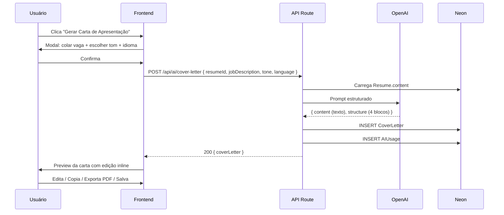

# Carta de Apresentação com IA

> Geração de **carta de apresentação personalizada** com base no currículo + vaga.
> Feature **Pro** de altíssimo valor percebido com baixo custo de implementação.

## Visão Geral

| Aspecto | Detalhe |
|---|---|
| **Feature gate** | Pro Mensal (10x/mês) / Pro Anual (ilimitado) |
| **Tela** | Modal dentro do editor + biblioteca em `/profile/cover-letters` |
| **API** | `POST /api/ai/cover-letter` |
| **IA** | OpenAI GPT-4o mini |
| **Schema DB** | `CoverLetter` |
| **Custo estimado** | ~US$0,002 por carta |

## Estrutura da Carta

A carta é gerada em **4 blocos** com peso balanceado:

| Bloco | Peso | Objetivo |
|---|:---:|---|
| **Abertura impactante** | 20% | Capturar atenção, mencionar a vaga e empresa |
| **Conexão com a vaga** | 40% | Mostrar fit entre experiência e requisitos |
| **Diferencial** | 25% | Proposta de valor única do candidato |
| **CTA final** | 15% | Chamada para ação (entrevista, conversa) |

## Tons Disponíveis

| Tom | Tom de voz | Quando usar |
|---|---|---|
| **Formal** | Respeitoso, tradicional | Empresas tradicionais, governo, jurídico |
| **Direto** | Conciso, objetivo | Startups, tech |
| **Criativo** | Personalidade forte, ousado | Agências, design, marketing |

## Idiomas Suportados

- 🇧🇷 **PT-BR** (padrão)
- 🇺🇸 **EN** (Pro Anual tem versão ilimitada em inglês)

## Fluxo



## Prompt

```ts
const systemPrompt = `
Você é um especialista em redação de cartas de apresentação para o mercado
brasileiro. Escreva uma carta personalizada, profissional, sem clichês
("ao尊敬的招聘经理", "Estou extremamente entusiasmado", etc).

Estrutura obrigatória:
1. Abertura impactante (1 parágrafo) — menciona a vaga e a empresa
2. Conexão com a vaga (2 parágrafos) — fit entre experiência e requisitos
3. Diferencial (1 parágrafo) — proposta de valor única
4. CTA final (1 parágrafo) — chamada para conversa/entrevista

Tom: ${tone}  // formal | direct | creative
Idioma: ${language}
Comprimento: 250-400 palavras.
NUNCA invente fatos. Use APENAS o que está no currículo.
NUNCA comece com "Eu me chamo" ou "Venho por meio desta".
`;

const userPrompt = `
CURRÍCULO:
${JSON.stringify(resumeContent)}

VAGA:
${jobDescription}
`;
```

## UI

```
┌─────────────────────────────────────────────────────────────┐
│  💌 Carta de Apresentação                                   │
│                                                             │
│  Tom:     ( ) Formal   (●) Direto   ( ) Criativo            │
│  Idioma:  (●) PT-BR    ( ) EN                              │
│  Vaga:    [text area com descrição da vaga...            ] │
│                                                             │
│                              [Cancelar]   [✨ Gerar Carta]   │
└─────────────────────────────────────────────────────────────┘

Após gerar:

┌─────────────────────────────────────────────────────────────┐
│  💌 Carta de Apresentação — Vaga Desenvolvedor Pleno        │
├─────────────────────────────────────────────────────────────┤
│  [Editor inline com a carta gerada]                         │
│                                                             │
│  Prezado(a) time de recrutamento da Empresa X,              │
│                                                             │
│  A posição de Desenvolvedor Pleno me chamou atenção         │
│  especialmente pelo trabalho da empresa com React em        │
│  escala...                                                  │
│                                                             │
│  [texto editável...]                                        │
│                                                             │
│  Atenciosamente,                                            │
│  João Silva                                                 │
├─────────────────────────────────────────────────────────────┤
│  [📋 Copiar]  [📄 Exportar PDF]  [💾 Salvar na biblioteca]  │
└─────────────────────────────────────────────────────────────┘
```

## Versões e Histórico

Cada carta salva gera um registro `CoverLetter`:

```ts
interface CoverLetter {
  id: string;
  userId: string;
  resumeId?: string;
  jobTitle: string;
  company?: string;
  jobDescription?: string;
  tone: 'formal' | 'direct' | 'creative';
  language: 'pt-BR' | 'en';
  content: string;          // Markdown
  createdAt: Date;
}
```

**Biblioteca:** lista em `/profile/cover-letters` com:
- Filtro por vaga / empresa
- Busca textual
- Botão "Duplicar como base"
- Export individual ou em lote

## Rate Limiting

| Plano | Limite |
|---|:---:|
| Free | ❌ Não tem |
| Pro Mensal | 10/mês |
| Pro Anual | ∞ |

## Edge Cases

1. **Currículo muito curto** → pedir mais detalhes antes de gerar
2. **Tom inadequado escolhido** (ex: criativo para vaga de advogado) → sugerir "Formal"
3. **IA escreve > 500 palavras** → truncar + avisar
4. **Clichês detectados** ("extremely excited", "dream job") → reescrever automaticamente
5. **Edição grande do usuário** → opção de "✨ Regenerar mantendo minhas edições"

## Métricas

| Métrica | Meta |
|---|:---:|
| Taxa de uso entre Pro | > 30% dos Pro/mês |
| Comprimento médio editado | < 30% (carta já está boa) |
| Cartas salvas vs. geradas | > 60% |
