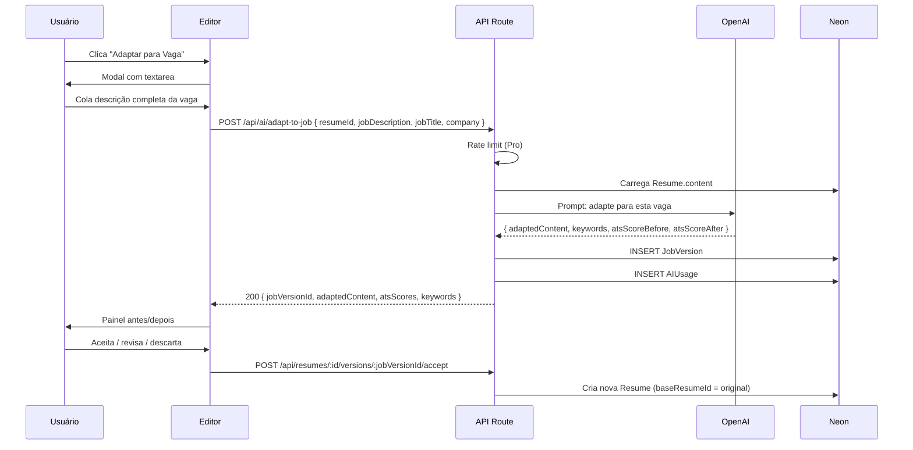

# Adaptação de Currículo por Vaga

> Feature **Pro** que adapta automaticamente o currículo para uma vaga
> específica, **aumentando a taxa de aprovação no ATS e a relevância para o
> recrutador**.

## Visão Geral

| Aspecto | Detalhe |
|---|---|
| **Feature gate** | Pro Mensal (20x/mês) / Pro Anual (ilimitado) |
| **Tela** | Modal dentro do editor + versão acessível em `/editor/[id]/versions` |
| **API** | `POST /api/ai/adapt-to-job` |
| **IA** | OpenAI GPT-4o mini (V2) |
| **Schema DB** | `JobVersion` |
| **Custo estimado** | ~US$0,003 por adaptação |

## Fluxo



## Prompt (resumido)

```ts
const systemPrompt = `
Você é um especialista em otimização de currículos para ATS no Brasil.
Reescreva o currículo fornecido para maximizar compatibilidade com a vaga,
mantendo APENAS fatos verdadeiros. NUNCA invente experiências, cargos,
empresas, datas ou habilidades.

Devolva JSON com:
- adaptedContent: estrutura completa do currículo adaptada
- keywords: { present: [], missing: [], added: [] }
- summaryChanges: 2-3 frases explicando o que mudou
- atsScoreBefore: número estimado 0-100
- atsScoreAfter: número estimado 0-100
`;

const userPrompt = `
CURRÍCULO ATUAL:
${JSON.stringify(currentContent)}

VAGA:
Título: ${jobTitle}
Empresa: ${company}
Descrição: ${jobDescription}

TAREFA: Adapte o currículo para esta vaga.
`;
```

## O que a IA Pode Alterar

| Seção | Alterações permitidas |
|---|---|
| **Resumo profissional** | ✅ Reescrito com foco na vaga, mantendo fatos |
| **Experiências** | ⚠️ Reordenar + ajustar verbos + adicionar keywords |
| **Habilidades** | ✅ Reordenar por relevância + adicionar keywords da vaga |
| **Formação** | ❌ Não alterar |
| **Projetos** | ⚠️ Reordenar + ajustar descrições |
| **Idiomas** | ❌ Não alterar |
| **Certificações** | ❌ Não alterar |

> A IA **nunca inventa** cargos, empresas, datas ou habilidades. Apenas reorganiza e ajusta ênfase.

## Output Esperado

```ts
interface AdaptResult {
  adaptedContent: ResumeContent;
  summaryChanges: string[];        // ['Reescrevi o resumo focando em...', 'Reordenei skills priorizando React e TypeScript']
  keywords: {
    present: string[];             // Já estavam no CV
    missing: string[];             // Estão na vaga mas ausentes (mantidas como "missing" — usuário decide se adiciona)
    added:   string[];             // Adicionadas ao CV adaptado (já estavam implícitas)
  };
  atsScoreBefore: number;          // Estimativa
  atsScoreAfter: number;           // Estimativa
}
```

## UI de Antes/Depois

```
┌─────────────────────────────────────────────────────────────┐
│  Adaptação para: "Desenvolvedor Pleno" — Empresa X          │
├─────────────────────────────────────────────────────────────┤
│                                                             │
│  ┌──────────────────┐          ┌──────────────────┐         │
│  │      ANTES       │          │      DEPOIS      │         │
│  │                  │          │                  │         │
│  │  ATS: 68         │   →      │  ATS: 91         │         │
│  │                  │          │                  │         │
│  │  Resumo:         │          │  Resumo:         │         │
│  │  "Dev full       │          │  "Desenvolvedor  │         │
│  │   stack com      │          │   Full Stack com │         │
│  │   experiência    │          │   7 anos...      │         │
│  │   em React"      │          │   [reator]       │         │
│  └──────────────────┘          └──────────────────┘         │
│                                                             │
│  Mudanças aplicadas:                                        │
│  ✓ Resumo reescrito com foco em React + Node + AWS          │
│  ✓ Habilidades reordenadas: React, TypeScript no topo       │
│  ✓ Adicionadas palavras-chave: "CI/CD", "testes E2E"        │
│                                                             │
│  Palavras-chave                                             │
│  ┌────────────────┬────────────────┬────────────────┐       │
│  │ Já presentes   │ Adicionadas    │ Ainda faltam   │       │
│  │ ✓ React        │ + CI/CD        │ ✗ Kubernetes   │       │
│  │ ✓ Node.js      │ + E2E testing  │ ✗ GraphQL      │       │
│  │ ✓ TypeScript   │                │                │       │
│  └────────────────┴────────────────┴────────────────┘       │
│                                                             │
│  [Descartar]   [Revisar no editor]   [✓ Aceitar versão]     │
└─────────────────────────────────────────────────────────────┘
```

## Versões por Vaga

Cada adaptação gera um registro `JobVersion` vinculado ao `Resume` base:

```
Resumes
├── 📄 Meu CV (base)                    [ATS: 78]
│   ├── 🏷️ Vaga Desenvolvedor Pleno - Empresa X  [ATS: 91]
│   ├── 🏷️ Vaga Tech Lead - Startup Y           [ATS: 87]
│   └── 🏷️ Vaga Sênior - Empresa Z              [ATS: 84]
```

**Benefícios:**
- Cada versão tem seu próprio PDF
- Histórico de scores para ver qual versão performou melhor
- Possível editar cada versão independentemente

## Permissões e Rate Limiting

| Plano | Limite mensal | Comportamento ao exceder |
|---|:---:|---|
| Free | ❌ Não tem | Botão "Adaptar" oculto |
| Pro Mensal | 20x | HTTP 429 + modal "Faça upgrade para Anual" |
| Pro Anual | ∞ | — |

> Chave de rate limit: `adapt:${userId}:${currentMonth}` em Upstash.

## Edge Cases

1. **Job description muito curta** (< 200 chars) → pedir mais detalhes
2. **CV já está 90+ ATS** → avisar "Seu CV já está otimizado. Adaptação pode não trazer grandes ganhos"
3. **Vaga em inglês** → IA adapta mantendo português no CV (ou detecta e pergunta idioma)
4. **Cargos incompatíveis** (CV de Designer, vaga de Engenheiro) → IA recusa e avisa
5. **Adaptação rejeitada pelo usuário** → JobVersion fica como `dismissed`, conta não é debitada

## Métricas

| Métrica | Meta |
|---|:---:|
| Aumento médio de score | +15 pontos |
| Taxa de aceitação (aceita / gera) | > 75% |
| Conversão Free → Pro (após tentar usar) | > 30% |
