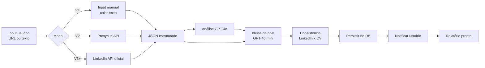

# LinkedIn Profile Auditor

> O **maior diferencial** do ATRION. Nenhum concorrente direto (Canva, Zety,
> Resume.io) oferece auditoria de LinkedIn integrada ao fluxo de criação de
> currículo.

## Visão Geral

| Aspecto | Detalhe |
|---|---|
| **Feature gate** | Free (1x/mês) / Pro Mensal (5x/mês) / Pro Anual (ilimitado) |
| **Tela de input** | `app/(app)/linkedin/page.tsx` |
| **Tela de relatório** | `app/(app)/linkedin/[auditId]/page.tsx` |
| **API** | `POST /api/linkedin/audit` + `GET /api/linkedin/audit/[id]` |
| **IA** | OpenAI GPT-4o (análise principal) + GPT-4o mini (ideias de post) |
| **Schema DB** | `LinkedInAudit` |
| **Custo** | ~US$0,01 por auditoria completa |

## Pipeline Completo



## 8 Seções Auditadas

| Seção | Peso | Critérios |
|---|:---:|---|
| **Foto de perfil** | 10% | Presente, rosto visível, fundo neutro, expressão profissional, ≥ 400x400px |
| **Foto de capa** | 5% | Presente, relevante, qualidade adequada |
| **Headline** | 20% | 60–120 chars, palavras-chave, proposta de valor, separadores |
| **About (resumo)** | 15% | 200–2000 chars, primeira pessoa, storytelling, CTA, palavras-chave |
| **Experiências** | 20% | Descrições detalhadas, métricas, verbos de ação, mídia anexada |
| **Habilidades** | 10% | ≥ 5 habilidades, relevância, endorsements |
| **Recomendações** | 10% | ≥ 1 (ideal ≥ 3), qualidade, reciprocidade |
| **Atividade (posts)** | 10% | Frequência últimos 90 dias, engajamento, variedade de formatos |

**Total = 100 pontos**

## Estratégia de Extração de Dados — 3 Camadas

| Camada | Tecnologia | Quando usar | Confiabilidade | Custo |
|---|---|---|:---:|---|
| **V1 (atual)** | Input manual (colar texto) | Lançamento | 100% | R$ 0 |
| **V2** | Proxycurl API | Após 50+ auditorias/mês | 99% | US$ 0,01/perfil |
| **V3+** | LinkedIn Official API | Após tração e aprovação | 100% oficial | Gratuito com aprovação |

> **Recomendação:** lançar com input manual + GIF instrutivo "Como copiar seu perfil".
> Migrar para Proxycurl no V2. Elimina risco de bloqueio e permite validar o produto.

## Estrutura do Perfil Extraído (JSON)

```jsonc
{
  "profileUrl": "https://linkedin.com/in/joaosilva",
  "extractedAt": "2026-06-12T14:32:00Z",
  "personal": {
    "name": "João Silva",
    "headline": "Desenvolvedor Full Stack na Empresa X",
    "location": "São Paulo, Brasil",
    "about": "Sou desenvolvedor com 5 anos...",
    "profilePhotoUrl": "https://...",
    "coverPhotoUrl": "https://...",
    "connectionsCount": 850,
    "followersCount": 1200
  },
  "experience": [
    {
      "company": "Empresa X",
      "role": "Tech Lead",
      "period": "jan 2022 - atual",
      "description": "Lidero time de 5 devs...",
      "mediaAttached": true
    }
  ],
  "education": [...],
  "skills": ["React", "Node.js", "TypeScript"],
  "endorsements": [{ "skill": "React", "count": 23 }],
  "recommendations": {
    "received": 2,
    "given": 5,
    "samples": ["João é um profissional excepcional..."]
  },
  "activity": {
    "postsLast90Days": 3,
    "avgEngagement": 45,
    "lastPostDate": "2026-05-10T...",
    "contentTypes": ["text", "image"]
  },
  "certifications": [...],
  "languages": [...],
  "volunteerWork": [...],
  "featuredSection": true,
  "openToWork": false
}
```

## Prompts

### Prompt Principal de Análise (GPT-4o)

```ts
const systemPrompt = `
Você é um especialista sênior em LinkedIn com 15 anos de experiência em
recrutamento e personal branding profissional no Brasil. Você já analisou
mais de 50.000 perfis LinkedIn.

Tarefa: analisar o perfil LinkedIn fornecido e gerar uma auditoria detalhada
em JSON. Seja direto, honesto e construtivo. Sempre forneça exemplos
concretos de como o campo deveria estar.

Responda APENAS com o JSON, sem markdown, sem explicações fora do JSON.
`;

const userPrompt = `
Analise este perfil LinkedIn:

DADOS DO PERFIL:
${JSON.stringify(profileData)}

ÁREA: ${area}
CARGO PRETENDIDO: ${targetJob}

Gere JSON com EXATAMENTE esta estrutura:
{
  overallScore: number (0-100),
  overallComment: string,
  sectionScores: {
    photo:         { score, maxScore: 10, issues: [...], suggestions: [...] },
    coverPhoto:    { score, maxScore: 5,  ... },
    headline:      { score, maxScore: 20, ..., suggestedHeadlines: [3 strings] },
    about:         { score, maxScore: 15, ..., rewrittenAbout: string },
    experience:    { score, maxScore: 20, ... },
    skills:        { score, maxScore: 10, ..., missingSkills: [...] },
    recommendations:{ score, maxScore: 10, ... },
    activity:      { score, maxScore: 10, ... }
  },
  keywordsGap:    { present: [], missing: [], recommended: [] },
  priorityActions: [5 strings]
}

Issue = { severity: 'critical'|'warning'|'info', description, fix }
`;
```

### Prompt de Ideias de Posts (GPT-4o mini)

```ts
const systemPrompt = `
Você é um especialista em criação de conteúdo para LinkedIn no Brasil.
Conhece profundamente o algoritmo e o que gera engajamento em PT-BR.
`;

const userPrompt = `
Com base neste perfil profissional, gere 7 ideias de post para LinkedIn.
Cada ideia deve ser personalizada para as experiências e conquistas reais.

PERFIL: ${JSON.stringify(profileSummary)}

Retorne JSON com array de 7 objetos:
{
  topic, hook, outline: [3-5], cta, hashtags: [5],
  format: 'text'|'carousel'|'poll'|'article',
  bestDay: 'tuesday'|'wednesday'|'thursday',
  bestTime: '08:00-09:00',
  estimatedReach: 'low'|'medium'|'high'
}
`;
```

### Prompt de Consistência LinkedIn × CV (GPT-4o mini)

```ts
const userPrompt = `
Compare o perfil LinkedIn e o currículo. Identifique:
1. Informações que divergem (datas, cargos, empresas)
2. Conquistas no CV que deveriam estar no LinkedIn
3. Habilidades mencionadas em um mas não no outro

LINKEDIN: ${JSON.stringify(profileData)}
CURRÍCULO: ${JSON.stringify(resumeContent)}

Retorne JSON: { divergences: [], missingFromLinkedin: [], missingFromResume: [] }
`;
```

## UI do Relatório

```
┌─────────────────────────────────────────────────────────────────┐
│  🔍 Auditoria LinkedIn — João Silva                            │
│  linkedin.com/in/joaosilva · 12/06/2026                        │
├─────────────────────────────────────────────────────────────────┤
│                                                                 │
│  ┌─────────┐  Perfil Score: 67/100                              │
│  │  FOTO   │  vs. Top 10% da sua área: 85/100                   │
│  │  JOÃO   │                                                   │
│  └─────────┘  Benchmark em 8 dimensões (radar chart)            │
│                                                                 │
│  ┌─ Headline ─────────────── 12/20 ────────────── [Expandir ▾] │
│  │ Headline atual:                                            │
│  │ "Desenvolvedor Full Stack na Empresa X"                    │
│  │                                                            │
│  │ Problemas:                                                 │
│  │ ✗ Apenas cargo + empresa (sem proposta de valor)            │
│  │ ✗ Sem palavras-chave (aparece em poucas buscas)            │
│  │ ✗ Curto demais (43 caracteres, ideal 60-120)               │
│  │                                                            │
│  │ Sugestões:                                                 │
│  │ ✓ "Dev Full Stack | React + Node | Construindo produtos    │
│  │    que escalam | 7 anos de experiência"                     │
│  │ ✓ "Engenheiro de Software · React, TypeScript, AWS ·      │
│  │    De startup a scale-up · Open to interesting projects"  │
│  │ ✓ "Desenvolvedor Full Stack | React + Node.js + AWS |     │
│  │    Liderança técnica, arquitetura, mentoria"               │
│  └────────────────────────────────────────────────────────────┘
│                                                                 │
│  ┌─ About (resumo) ────────── 4/15 ─────────────── [Expandir ▾] │
│  │ Atual: "" (vazio)                                          │
│  │                                                            │
│  │ Versão reescrita pela IA:                                  │
│  │ "Sou Desenvolvedor Full Stack com 7 anos de experiência... │
│  │  [300-500 palavras]"                                       │
│  │ [✨ Copiar] [📝 Editar]                                    │
│  └────────────────────────────────────────────────────────────┘
│                                                                 │
│  ┌─ Ideias de Post LinkedIn ─────────────────── [7 ideias] ──┐ │
│  │ 💡 "O erro que quase derrubou nossa produção em Black..."  │ │
│  │    Hook: "Às 23h do Black Friday, nossa API caiu..."        │ │
│  │    [Expandir] [📋 Copiar outline]                            │ │
│  │                                                              │ │
│  │ 💡 "Por que parei de usar ORM em 2024"                       │ │
│  │    Hook: "Depois de 5 anos com ORM, percebi que..."           │ │
│  │    [Expandir] [📋 Copiar outline]                            │ │
│  │                                                              │ │
│  │ [+ 5 mais]                                                   │ │
│  └──────────────────────────────────────────────────────────────┘ │
│                                                                 │
│  ┌─ Consistência com CV ─────────────────────────────────────┐ │
│  │ Divergências encontradas: 2                                │ │
│  │ ✗ LinkedIn diz "5 anos" · CV diz "7 anos"                  │ │
│  │ ✗ LinkedIn lista "React" 3x · CV não menciona              │ │
│  │ [Ver detalhes]                                              │ │
│  └────────────────────────────────────────────────────────────┘ │
│                                                                 │
│  Palavras-chave faltantes:                                     │
│  [TypeScript] [Docker] [CI/CD] [GraphQL] [Kubernetes]          │
│                                                                 │
│  Top 5 ações prioritárias:                                     │
│  1. Reescrever headline com proposta de valor                   │
│  2. Escrever resumo de 300-500 palavras                        │
│  3. Adicionar métricas em todas as experiências                │
│  4. Pedir 2-3 recomendações a colegas/líderes                 │
│  5. Postar 1x por semana (ver ideias acima)                    │
│                                                                 │
│  [📄 Exportar Relatório PDF]   [🔄 Refazer auditoria]         │
└─────────────────────────────────────────────────────────────────┘
```

## Categorias de Ideias de Post

| Categoria | Quando usar | Engajamento |
|---|---|---|
| **Lição aprendida** | Situações profissionais superadas | Alto |
| **Bastidores do trabalho** | Processos, decisões, criação | Médio-alto |
| **Opinião controversa** | Discorde de prática comum com argumentos | Muito alto |
| **Conquista com contexto** | Promoção, projeto, certificação | Médio |
| **Tutorial / How-to** | Ensinar algo técnico | Alto |
| **Carreira honesta** | Dificuldades, erros, transições | Muito alto |
| **Tendência da área** | Novidades do setor com análise | Médio |

## Polling de Status

Auditoria é **assíncrona** (pode levar 30–60s). Frontend faz polling:

```ts
// A cada 2s por até 60s
const poll = async (auditId: string) => {
  const res = await fetch(`/api/linkedin/audit/${auditId}`);
  const { status, result, error, progress } = await res.json();

  if (status === 'done') return result;
  if (status === 'failed') throw new Error(error);

  // Atualizar UI com progress.step ('Analisando foto...', etc.)
  await sleep(2000);
  return poll(auditId);
};
```

## Tratamento de Erros

| Situação | Resposta |
|---|---|
| Perfil LinkedIn privado | 422 — "Use a opção de colar o texto manualmente" |
| Perfil não encontrado | 404 — "Verifique a URL e tente novamente" |
| LinkedIn bloqueou requisição | Retry 3x com backoff. Fallback: input manual |
| Timeout IA (> 60s) | Cancelar + registrar failed + notificar |
| Perfil sem dados (< 100 chars) | Análise parcial com score baixo |
| Limite do plano atingido | 429 + modal de upgrade |
| JSON da IA malformado | Retry com `temperature: 0.1` |

## Rate Limiting

| Plano | Limite | Reset |
|---|:---:|---|
| Free | 1/mês | Mensal |
| Pro Mensal | 5/mês | Mensal |
| Pro Anual | ∞ | — |

## Estratégia de Gate e Conversão

| Ponto | Comportamento |
|---|---|
| Free tenta 2ª auditoria | Modal de upgrade |
| Free vê ideias de post | Blur nos cards + "Desbloqueie — Pro" |
| Free vê "About reescrito" | Preview do 1º parágrafo + lock |
| Free vê consistência CV × LinkedIn | Bloqueado + "Recurso Pro" |
| Pro Mensal na 6ª | "Upgrade para Anual — ilimitado" |

## Métricas

| Métrica | Meta 3m | Meta 6m |
|---|:---:|:---:|
| Audit completion rate | > 90% | > 95% |
| Audit → upgrade conversion | > 15% | > 25% |
| Post idea copied | > 40% | > 60% |
| Repeat audit em 30 dias | > 20% | > 40% |
| LinkedIn score improvement (2ª+) | +12 pontos | +20 pontos |
| NPS isolado da feature | > 55 | > 65 |
