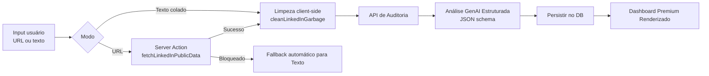

# LinkedIn Profile Auditor

> O **maior diferencial** do ATRION. Nenhum concorrente direto oferece auditoria de LinkedIn impulsionada por IA estruturada integrada ao fluxo de criação de currículo.

## Visão Geral

| Aspecto | Detalhe |
|---|---|
| **Feature gate** | Free (1x/mês) / Pro Mensal (5x/mês) / Pro Anual (ilimitado) |
| **Tela de input** | `app/(app)/linkedin/page.tsx` (Abas para Texto ou URL) |
| **Tela de relatório** | `app/(app)/linkedin/[id]/page.tsx` |
| **API** | `POST /api/linkedin/audit` + Server Action `fetchLinkedInPublicData` |
| **IA** | Modelos GenAI estruturados (ex: Gemini 2.5 Flash Lite) |
| **Schema DB** | `LinkedInAudit` |

## Pipeline Completo


```mermaid
flowchart LR
    A[Input usuário<br/>URL ou texto] --> B{Modo}
    B -->|Texto colado| C[Limpeza client-side<br/>cleanLinkedInGarbage]
    B -->|URL| D[Server Action<br/>fetchLinkedInPublicData]
    D -->|Bloqueado| E[Fallback automático para Texto]
    D -->|Sucesso| C
    C --> F[API de Auditoria]
    F --> G[Análise GenAI Estruturada<br/>JSON schema]
    G --> H[Persistir no DB]
    H --> I[Dashboard Premium Renderizado]
```

## 8 Categorias Avaliadas pela IA (Cards)

| Categoria | Descrição |
|---|---|
| **Compatibilidade ATS** | O quão bem o perfil é lido por robôs de recrutamento. |
| **SEO do LinkedIn** | Posicionamento em buscas e uso de palavras-chave. |
| **Marca Pessoal** | Nível de autoridade, foto, banner e tom de voz. |
| **Experiência Profissional** | Uso de métricas e detalhamento das vivências. |
| **Competências Técnicas** | Skills relevantes para a área e vaga alvo. |
| **Projetos** | Presença de portfólio, links ou repositórios. |
| **Certificações** | Comprovações acadêmicas e de cursos rápidos. |
| **Qualidade Geral** | Consistência e clareza da comunicação. |

## Estratégia de Extração de Dados — Abordagem Híbrida

| Camada | Tecnologia | Quando usar | Comportamento |
|---|---|---|---|
| **URL do LinkedIn** | Server Action + Fetch simples | Preferencial | Tenta extrair a public view. Devido a anti-scraping severo do LinkedIn, costuma falhar com 999. |
| **Fallback / Texto Manual** | Colar texto bruto + `cleanLinkedInGarbage` | Secundário (ou automático em falhas) | Usuário dá Ctrl+A no perfil. Sistema remove o lixo visual e menus antes de enviar à IA. Confiabilidade 100%. |

## Estrutura do Relatório Gerado (JSON de Retorno da IA)

```jsonc
{
  "overallScore": 85,
  "executiveSummary": "Resumo executivo do perfil segundo um recrutador.",
  "categories": [
    {
      "id": "ats",
      "title": "Compatibilidade ATS",
      "score": 90,
      "explanation": "...",
      "recommendations": ["..."]
    }
    // ... e demais categorias
  ],
  "keywords": {
    "missing": ["Docker"],
    "suggested": ["CI/CD"],
    "matchWithTarget": "Análise sobre como o perfil bate com a vaga desejada."
  },
  "generatedContent": {
    "headline": "Sugestão de headline de alto impacto",
    "about": "Um resumo (Sobre) completamente reescrito.",
    "experienceImprovements": [
      {
        "companyOrRole": "Cargo na Empresa X",
        "suggestion": "Inclua métricas financeiras aqui."
      }
    ]
  },
  "actionPlan": [
    {
      "id": "a1",
      "priority": "high", // high, medium, low
      "action": "O que fazer",
      "impact": "Impacto esperado"
    }
  ],
  "metrics": {
    "charCount": 4500,
    "wordCount": 700,
    "hasNumbers": true,
    "hasLinks": true
  }
}
```

## Dashboard de Resultados (UI)

O painel foi completamente redesenhado com uma experiência SaaS premium utilizando componentes do Tailwind e Framer Motion (`animate-in`):

1. **Gauge Chart**: No topo, exibindo o `overallScore` de 0 a 100.
2. **Resumo Executivo**: Explicando a percepção humana sobre o perfil.
3. **Plano de Ação Kanban**: Lista de tarefas categorizada por Prioridade.
4. **Grid de Categorias**: Cartões individuais para ATS, SEO, etc., com barras de progresso animadas e botões de expansão de dicas.
5. **Conteúdo Sugerido**: Blocos prontos para copiar (Headline e Sobre).
6. **Mapeamento de Palavras-chave**: Badges verdes e vermelhos comparando o perfil com a vaga.

## Tratamento de Erros

| Situação | Resposta |
|---|---|
| **LinkedIn bloqueia URL via 999** | Interceptado. Toast pede para colar o texto e a aba de texto é ativada. |
| **Usuário cola texto com lixo visual** | O utilitário `cleanLinkedInGarbage` varre e remove "Messaging", "Me", "Notifications", limpando tokens. |
| **Texto muito curto (< 100 chars)** | Barrado no Client-side com erro de validação. |
| **Falha de parse no JSON da IA** | API responde 500, trata no client exibindo "Erro ao analisar o perfil com IA". |
