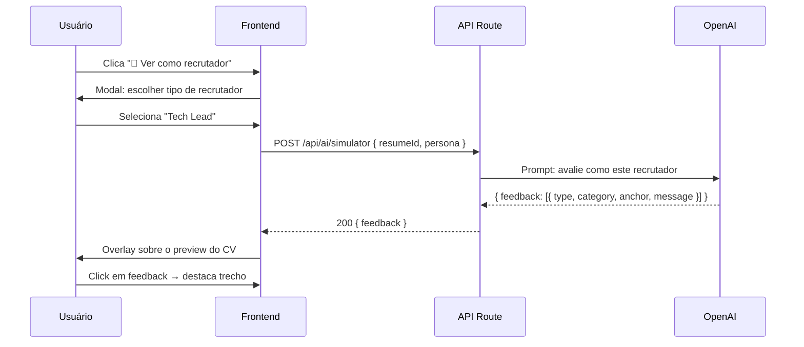

# Simulador de Visão do Recrutador

> Mostra o currículo **como um recrutador experiente veria**, com comentários
> inline sobre pontos fortes, pontos fracos e sugestões específicas. Feature
> **Pro** de altíssimo valor percebido.

## Visão Geral

| Aspecto | Detalhe |
|---|---|
| **Feature gate** | Pro Mensal (5x/mês) / Pro Anual (ilimitado) |
| **Tela** | `app/(app)/simulator/[id]/page.tsx` |
| **API** | `POST /api/ai/simulator` |
| **IA** | OpenAI GPT-4o mini |
| **Custo** | ~US$0,002 por simulação |

## Tipos de Análise

| Tipo | Descrição | Quando usar |
|---|---|---|
| **Recrutador corporativo** | Foco em fit técnico + cultura | Vagas em empresas grandes |
| **Recrutador startup** | Foco em ownership + velocidade | Vagas em startups |
| **Tech Lead** | Foco em profundidade técnica | Vagas técnicas sênior |
| **Headhunter** | Foco em senioridade + faixa salarial | Recrutamento executivo |

## Output (formato)

```
Como um recrutador vê seu currículo:

✓ PONTO FORTE: Progressão de carreira clara e consistente
✓ PONTO FORTE: Projeto pessoal demonstra iniciativa

✗ PONTO FRACO: Resumo genérico — poderia ser de qualquer pessoa
✗ PONTO FRACO: Última experiência sem nenhuma métrica

! SUGESTÃO: Adicione o impacto do seu trabalho em números
! SUGESTÃO: Customize o resumo para esta área específica
```

## Categorias de Feedback

| Ícone | Categoria | Significado |
|---|---|---|
| ✓ verde | **Ponto forte** | O que está funcionando bem |
| ✗ vermelho | **Ponto fraco** | Problema concreto que prejudica |
| ! amarelo | **Sugestão** | Melhoria que elevaria o nível |
| ? azul | **Pergunta** | Informação que ficou ambígua |

## Fluxo



## Estrutura do Output

```ts
interface SimulatorFeedback {
  overall: {
    score: number;         // 0-100 (subjectivo)
    verdict: string;       // "Perfil forte para vagas pleno", "Faltam sinais de senioridade"
  };
  feedback: FeedbackItem[];
  nextSteps: string[];    // Top 3 ações
}

interface FeedbackItem {
  type: 'strength' | 'weakness' | 'suggestion' | 'question';
  category: 'summary' | 'experience' | 'skills' | 'projects' | 'formatting' | 'positioning';
  anchor?: {              // Onde no CV o feedback se aplica
    section: 'personal' | 'experience' | 'skills' | ...;
    itemId?: string;      // ID do item específico (ex: experiência[0])
  };
  message: string;
}
```

## UI

```
┌─────────────────────────────────────────────────────────────┐
│  👀 Visão do Recrutador — Persona: Tech Lead                │
├─────────────────────────────────────────────────────────────┤
│  ┌───────────────────────┐   ┌────────────────────────────┐ │
│  │  Preview do CV        │   │  Feedback                  │ │
│  │                       │   │                            │ │
│  │  ┌─ Resumo ────────┐  │   │  ✓ Progressão de carreira  │ │
│  │  │ Dev full stack │←─│───│─│  clara e consistente       │ │
│  │  │ com experiência│  │   │                            │ │
│  │  └────────────────┘  │   │  ✗ Resumo genérico         │ │
│  │                       │   │     "Poderia ser de        │ │
│  │  ┌─ Experiência ───┐  │   │      qualquer pessoa"      │ │
│  │  │ Tech Lead @ X   │  │   │                            │ │
│  │  │ ...             │←─│───│─│  ! Adicione métricas       │ │
│  │  └────────────────┘  │   │     "Liderei time de 5"    │ │
│  │                       │   │                            │ │
│  └───────────────────────┘   │  Próximos passos:          │ │
│                              │  1. Personalizar resumo    │ │
│                              │  2. Quantificar impacto    │ │
│                              │  3. Adicionar 2 cases      │ │
│                              └────────────────────────────┘ │
└─────────────────────────────────────────────────────────────┘
```

## Rate Limiting

| Plano | Limite |
|---|:---:|
| Free | ❌ Não tem |
| Pro Mensal | 5/mês |
| Pro Anual | ∞ |

## Edge Cases

1. **Currículo muito vazio** → não rodar, sugerir completar primeiro
2. **Currículo já otimizado** (ATS 90+) → feedback mais "polish", menos crítico
3. **Persona em conflito com o CV** (recrutador executivo para CV de júnior) → ajustar tom do feedback
4. **Múltiplas personas** (combinar?) → V2+ permite ver 2 personas sequencialmente

## Métricas

| Métrica | Meta |
|---|:---:|
| % de Pro que experimentam | > 40% |
| Feedback que leva a edição no CV | > 50% |
| NPS da feature isolada | > 60 |
