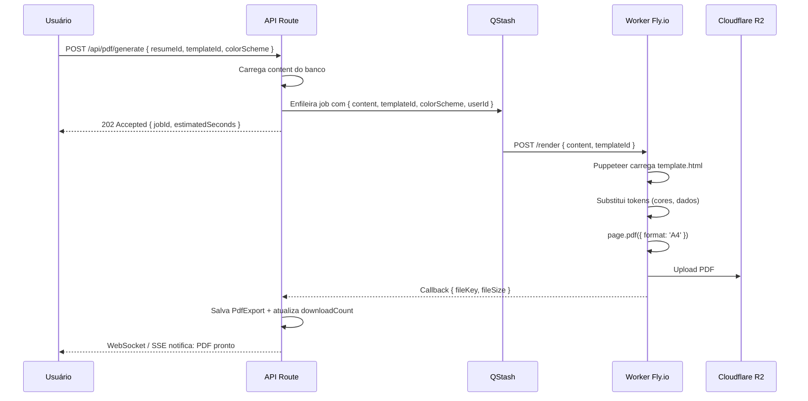

# Templates de Currículo

> 10 templates profissionais: **3 Free** + **7 Pro**. Renderizados em HTML/CSS
> puro e convertidos em PDF pelo Puppeteer.

## Catálogo

| Template | Estilo | Layout | Plano | Ideal Para |
|---|---|---|---|---|
| **Classic** | Clássico | 1 coluna, serif | 🆓 Free | Direito, Finanças, Governo |
| **Modern** | Moderno | 2 colunas, sidebar | 🆓 Free | Tecnologia, Marketing |
| **Minimal** | Minimalista | 1 coluna, muito espaço branco | 🆓 Free | Design, Criatividade |
| **Executive** | Executivo | Header largo, linha separadora | 💎 Pro | C-Level, Diretores |
| **Creative** | Criativo | Header colorido, foto circular | 💎 Pro | Design, Publicidade |
| **Tech** | Técnico | Skills em destaque, dark mode opcional | 💎 Pro | Engenharia de Software |
| **Academic** | Acadêmico | Publicações, estilo europeu | 💎 Pro | Pesquisa, Academia |
| **Sales** | Vendas | Métricas em destaque, resultados | 💎 Pro | Comercial, SDR, Account |
| **Healthcare** | Saúde | Layout formal, certificações | 💎 Pro | Medicina, Enfermagem |
| **International** | Internacional | Sem foto, estilo global | 💎 Pro | Vagas internacionais |

## Paletas de Cores

Cada template aceita **paleta de cores** (customizável pelo usuário):

- **Free:** 3 paletas básicas (azul, cinza, preto)
- **Pro:** 20+ paletas (azul, verde, roxo, rosa, laranja, vermelho, etc.)

Token de cor primária injetado via CSS variable no momento da renderização.

## Estrutura de Arquivos

```
components/resume-templates/
├── Classic/
│   ├── index.tsx              # Componente React (preview)
│   ├── template.html          # HTML para Puppeteer
│   ├── styles.css             # CSS dedicado
│   └── tokens.ts              # Mapeamento de cores
├── Modern/
├── Minimal/
└── ...
```

> O componente React é usado no **preview** do editor.
> O `template.html` é enviado para o **worker Puppeteer** gerar o PDF.

## Renderização no Preview (Editor)

```tsx
// app/(app)/editor/[id]/page.tsx
import { TemplateRegistry } from '@/components/resume-templates';

function Preview({ templateId, content, colorScheme }) {
  const Template = TemplateRegistry[templateId];
  return <Template content={content} colorScheme={colorScheme} />;
}
```

## Geração de PDF (Puppeteer)



> Detalhes completos em [`/docs/flows/pdf-export.md`](../flows/pdf-export.md).

## Marca d'água (Free)

Usuários Free recebem PDF com marca d'água diagonal semitransparente:

```css
.watermark::before {
  content: 'ATRION Free';
  position: fixed;
  top: 50%; left: 50%;
  transform: translate(-50%, -50%) rotate(-30deg);
  font-size: 80px;
  color: rgba(0, 0, 0, 0.08);
  pointer-events: none;
  z-index: -1;
}
```

## Qualidade Visual

- **Fontes:** Inter (UI) + Lato / Source Serif (conteúdo) via Google Fonts
- **Resolução:** A4 (210 × 297 mm)
- **Márgens:** 2cm padrão
- **Cor:** CMYK-friendly (evita gradientes críticos na impressão)
- **Testes visuais:** Playwright screenshot de cada template × 3 cores × 5 tamanhos de nome

## Adicionar um Novo Template

1. Criar pasta em `components/resume-templates/NomeDoTemplate/`
2. Implementar `index.tsx` (preview) + `template.html` (PDF) + `styles.css`
3. Adicionar ao `TemplateRegistry`
4. Atualizar seed em `prisma/seed.ts` (config: `templateId`, `isPro`, `colorPalettes`)
5. Adicionar preview screenshot em `public/templates/`
6. Documentar no `docs/features/templates.md`

## SEO de Templates (V3)

Páginas públicas indexáveis em `app/(marketing)/templates/[id]/page.tsx`:

- `/templates/desenvolvedor` (CV Modern)
- `/templates/engenheiro` (CV Tech)
- `/templates/medico` (CV Healthcare)
- etc.

Cada página tem:
- Hero com preview animado do template
- "Use este template grátis" → CTA signup
- Conteúdo SEO: "Como fazer currículo de [cargo]"
- Schema.org `CreativeWork` + `FAQPage`

**Volume de busca estimado:** 22.000/mês para "currículo online grátis" + long-tail.
