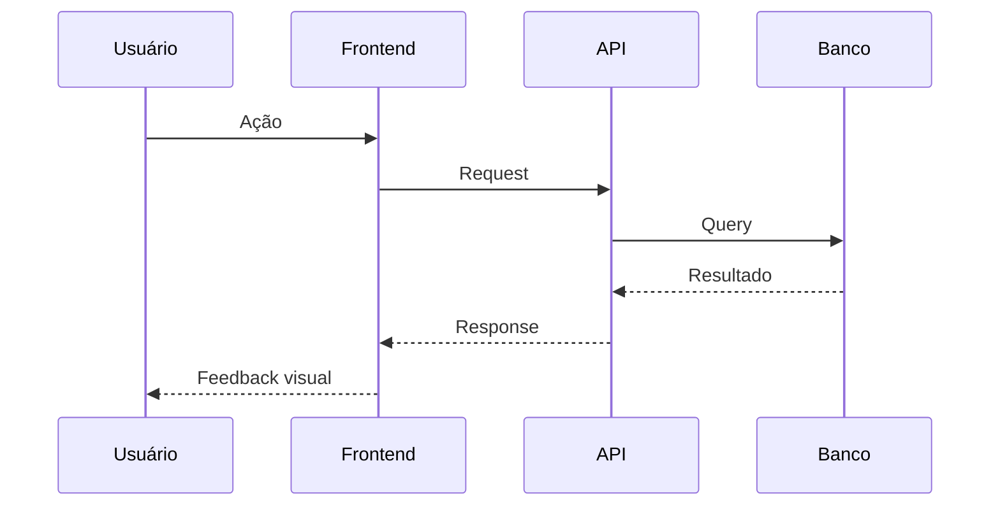

# 🔄 Fluxos do ATRION

> Catálogo completo de **fluxos de usuário** e **processos internos**, com
> diagramas Mermaid e descrição textual detalhada.

## Índice

### 👤 Fluxos de Usuário
- 🆕 [**Onboarding (Primeiro Acesso)**](./user-onboarding.md) — Da landing page ao primeiro currículo
- 📝 [**Criação de Currículo**](./resume-creation.md) — Editor completo, do zero ao PDF
- 📄 [**Exportação de PDF**](./pdf-export.md) — Pipeline Puppeteer → R2 → download
- 🎯 [**Adaptação por Vaga**](./job-adaptation.md) — IA adapta CV para uma vaga
- 🔍 [**Auditoria de LinkedIn**](./linkedin-audit.md) — URL → relatório completo
- 💳 [**Upgrade Free → Pro**](./upgrade-flow.md) — Stripe Checkout + webhook
- 🔐 [**Ativação de MFA**](../../features/authentication.md#mfa-totp) — TOTP com QR Code
- 🔁 [**Recuperação de Senha**](../../features/authentication.md#recuperação-de-senha) — Token de 1h

### ⚙️ Processos Internos
- 🤖 [**Pipeline de Geração de PDF**](./pdf-export.md) — Puppeteer worker + fila QStash
- 📊 [**Pipeline de ATS Score**](../../features/ats-score.md#fluxo-de-análise) — 6 dimensões + IA
- 🛡️ [**Auditoria e Logs**](../architecture/security.md#6-trilha-de-auditoria) — AuditAction enum
- 💾 [**Backup Automático**](../architecture/security.md#7-estratégia-de-backup) — pg_dump + rclone

---

## Convenções dos Diagramas

Todos os diagramas usam **Mermaid** (compatível com GitHub, GitLab, VS Code).

**Legenda de cores (quando aplicável):**
- 🟢 Verde — Sucesso
- 🟡 Amarelo — Aguardando ação do usuário
- 🔴 Vermelho — Erro / Falha
- 🔵 Azul — Processo interno / IA
