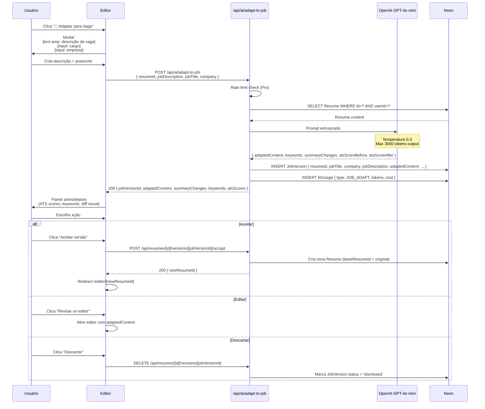

# Fluxo: Adaptação de Currículo por Vaga

> A IA reescreve o currículo do usuário para maximizar compatibilidade com uma
> vaga específica colada. Feature **Pro** de maior conversão.

## Visão Geral

| Aspecto | Detalhe |
|---|---|
| **Feature gate** | Pro Mensal (20x/mês) / Pro Anual (ilimitado) |
| **Trigger** | Botão "Adaptar para Vaga" no editor ou dashboard |
| **Latência** | 5–15s |
| **Custo IA** | ~US$ 0,003 por adaptação |
| **Schema DB** | `JobVersion` |

## Diagrama



## Modal de Input

```
┌────────────────────────────────────────────────────────────┐
│  🎯 Adaptar Currículo para Vaga Específica                │
│                                                            │
│  Cargo:  [Desenvolvedor Pleno React              ]         │
│  Empresa: [Empresa X                            ] (opcional)│
│                                                            │
│  Cole a descrição completa da vaga:                        │
│  ┌────────────────────────────────────────────────────┐    │
│  │ A Empresa X está procurando um Desenvolvedor       │    │
│  │ Pleno React para integrar o time de produto.       │    │
│  │                                                    │    │
│  │ Responsabilidades:                                 │    │
│  │ - Desenvolver features em React + TypeScript       │    │
│  │ - ...                                              │    │
│  │                                                    │    │
│  │ Requisitos:                                        │    │
│  │ - 3+ anos com React                               │    │
│  │ - TypeScript, Node.js, AWS                        │    │
│  │ - ...                                              │    │
│  │                                                    │    │
│  └────────────────────────────────────────────────────┘    │
│  1.243 caracteres                                          │
│                                                            │
│              [Cancelar]    [✨ Adaptar currículo]           │
└────────────────────────────────────────────────────────────┘
```

## Painel Antes/Depois

```
┌────────────────────────────────────────────────────────────────┐
│  🎯 Adaptação para: Desenvolvedor Pleno React — Empresa X     │
│  Versão salva em "Meus currículos" → "Vaga Empresa X"         │
├────────────────────────────────────────────────────────────────┤
│                                                                │
│   ┌──── ANTES ────┐                  ┌──── DEPOIS ────┐         │
│   │  ATS: 68      │      →           │  ATS: 91       │         │
│   │               │                  │  (+23 pontos)  │         │
│   └───────────────┘                  └───────────────┘         │
│                                                                │
│  ✏️ Resumo profissional                                        │
│  ┌──────────────────────────┐  ┌──────────────────────────┐    │
│  │ "Dev full stack com      │  │ "Desenvolvedor Full      │    │
│  │  experiência em React"   │  │  Stack com 7 anos de     │    │
│  │                          │  │  experiência em React,   │    │
│  │  (2 linhas, genérico)    │  │  TypeScript e Node.js.   │    │
│  │                          │  │  Especialista em..."     │    │
│  │                          │  │                          │    │
│  │                          │  │  (5 linhas, específico)  │    │
│  └──────────────────────────┘  └──────────────────────────┘    │
│                                                                │
│  🏷️ Habilidades reordenadas                                    │
│  Antes: Java, Python, React, Node                              │
│  Depois: React, TypeScript, Node.js, AWS, CI/CD                │
│                                                                │
│  ✅ Mudanças aplicadas                                         │
│  ✓ Resumo reescrito com foco em React + TypeScript             │
│  ✓ Habilidades reordenadas: React no topo                      │
│  ✓ Adicionadas palavras-chave: "CI/CD", "testes E2E"           │
│  ✓ Experiência "Tech Lead @ Y" destacada (liderança)           │
│                                                                │
│  🔑 Palavras-chave                                             │
│  ┌────────────────┬────────────────┬────────────────┐           │
│  │ Presentes (8)  │ Adicionadas(3) │ Ainda faltam(3)│           │
│  │ ✓ React        │ + CI/CD        │ ✗ Kubernetes   │           │
│  │ ✓ Node.js      │ + E2E testing  │ ✗ GraphQL      │           │
│  │ ✓ TypeScript   │ + AWS Lambda   │ ✗ Terraform    │           │
│  │ ✓ JavaScript   │                │                │           │
│  └────────────────┴────────────────┴────────────────┘           │
│                                                                │
│         [Descartar]   [✏️ Revisar no editor]   [✅ Aceitar]    │
└────────────────────────────────────────────────────────────────┘
```

## Validação da Adaptação (regras de negócio)

A IA é instruída a **NUNCA inventar**:

```ts
const VALIDATION_RULES = {
  neverInvent: ['companies', 'roles', 'dates', 'skills', 'achievements'],
  canModify: ['summary', 'skills.order', 'experience.description.emphasis'],
  cannotModify: ['personal.name', 'personal.email', 'education.degree'],
};
```

> Verificação pós-IA: o JSON retornado deve ter as mesmas `companies`, `roles` e `dates` que o currículo original. Se a IA alucinar, descartar e retentar.

## Persistência

```prisma
model JobVersion {
  id              String   @id @default(cuid())
  resumeId        String   // Currículo base
  jobTitle        String
  company         String?
  jobDescription  String
  adaptedContent  Json     // Mesma estrutura de Resume.content
  atsScoreBefore  Int?
  atsScoreAfter   Int?
  keywords        Json     // { present, missing, added }
  summaryChanges  Json     // [string] - frases explicando mudanças
  status          String   @default('draft') // draft | accepted | dismissed
  createdAt       DateTime @default(now())
  acceptedAt      DateTime?
  acceptedAsResumeId String?  // FK → Resume (a nova versão criada)
  resume          Resume   @relation(...)
}
```

## Rate Limiting

```ts
const ratelimitAdapt = new Ratelimit({
  redis: upstash,
  limiter: Ratelimit.tokenBucket(20, '1 month', 20), // 20 tokens, 1 refill/mês
  analytics: true,
  prefix: 'adapt',
});
```

| Plano | Limite |
|---|:---:|
| Free | ❌ Não tem |
| Pro Mensal | 20/mês |
| Pro Anual | ∞ |

## Edge Cases

| Situação | Tratamento |
|---|---|
| Job description < 200 chars | Pedir mais detalhes |
| Currículo vazio (completeness 0) | Não permitir adaptar — completar primeiro |
| CV já está 90+ ATS | "Seu CV já está otimizado. Continuar mesmo assim?" |
| Cargos incompatíveis (dev ↔ design) | IA recusa + avisa "Esta vaga não parece relacionada" |
| Vaga em inglês | Detectar + perguntar idioma do CV adaptado |
| Adaptação rejeitada | JobVersion fica como `dismissed`, **não desconta do limite** |
| IA alucina (verificação detecta) | Retry com prompt mais restritivo (max 2x) + fallback para aviso |

## Métricas

| Métrica | Meta V2 | Meta V3 |
|---|:---:|:---:|
| Aumento médio de ATS | +15 pts | +20 pts |
| Taxa de aceitação (aceita/gera) | > 75% | > 85% |
| % de Pro que usam em 30d | > 60% | > 80% |
| Conversão Free → Pro após tentar | > 30% | > 50% |
| NPS da feature | > 60 | > 70 |
