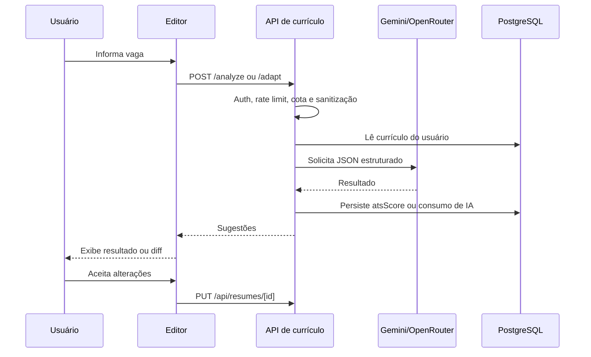

# Análise e adaptação por vaga

```mermaid
sequenceDiagram
  participant U as Usuário
  participant E as Editor
  participant API as API de currículo
  participant AI as Gemini/OpenRouter
  participant D as PostgreSQL
  U->>E: Informa vaga
  E->>API: POST /analyze ou /adapt
  API->>API: Auth, rate limit, cota e sanitização
  API->>D: Lê currículo do usuário
  API->>AI: Solicita JSON estruturado
  AI-->>API: Resultado
  API->>D: Persiste atsScore ou consumo de IA
  API-->>E: Sugestões
  E-->>U: Exibe resultado ou diff
  U->>E: Aceita alterações
  E->>API: PUT /api/resumes/[id]
```

A adaptação não altera o currículo no banco até o usuário aceitar e salvar o diff no editor.