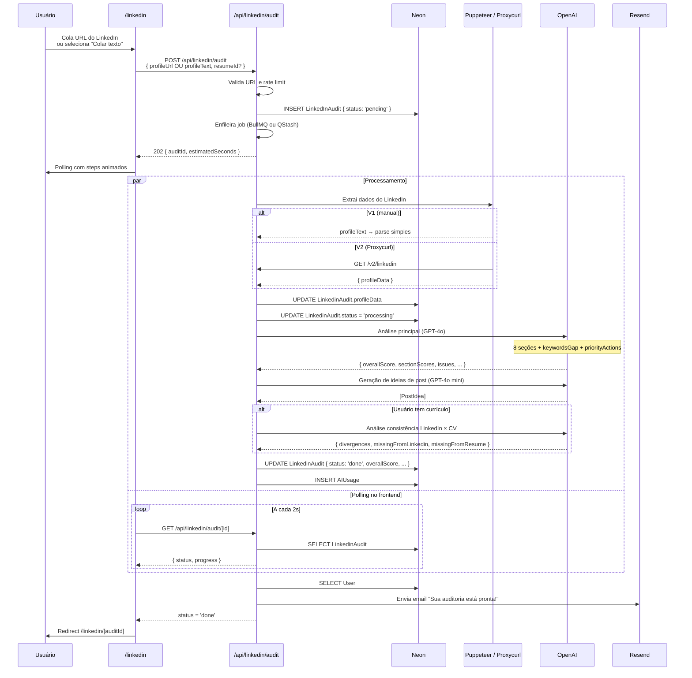
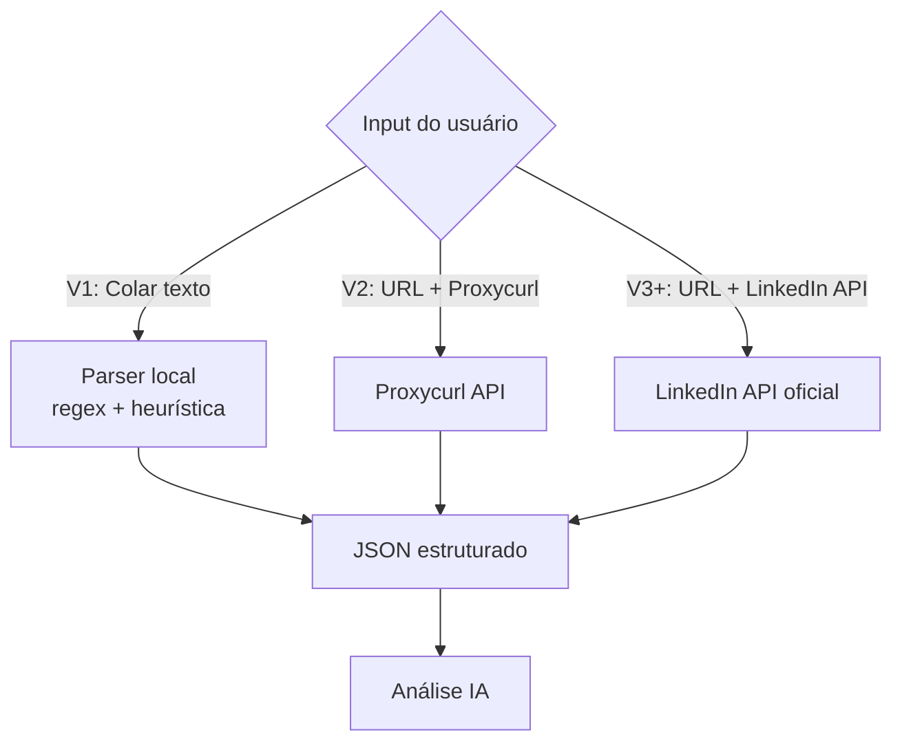

# Fluxo: Auditoria de LinkedIn

> Pipeline completo: input do usuário → extração → análise IA → ideias de post
> → persistência → relatório. O **maior diferencial** do produto.

## Visão Geral

| Aspecto | Detalhe |
|---|---|
| **Feature gate** | Free (1/mês) / Pro (5/mês) / Anual (∞) |
| **Trigger** | Sidebar → "LinkedIn Audit" |
| **Latência total** | 25–70s (assíncrono) |
| **Custo IA** | ~US$ 0,01 por auditoria |
| **Schema DB** | `LinkedInAudit` |

## Diagrama



## Polling Animado

Durante o processamento, frontend mostra progresso com steps:

```
┌────────────────────────────────────────────────────────────┐
│  🔍 Auditando seu perfil LinkedIn...                       │
│                                                            │
│  ▰▰▰▰▰▰▰▰▰▰▰▰▰▰▱▱▱▱▱▱▱▱▱  68%                            │
│                                                            │
│  ✓ Acessando perfil público                                │
│  ✓ Extraindo dados (nome, headline, experiências...)       │
│  ✓ Analisando foto de perfil                               │
│  ✓ Avaliando headline e resumo                             │
│  ● Verificando experiências e métricas... (em andamento)   │
│  ○ Comparando com top 10% da sua área                      │
│  ○ Gerando ideias de post personalizadas                   │
│  ○ Analisando consistência com seu currículo               │
│                                                            │
│  ⏱️ Tempo estimado: ~30 segundos                            │
└────────────────────────────────────────────────────────────┘
```

## Estratégia de Extração de Dados (3 Camadas)



### V1 — Input Manual (colagem de texto)

**UX:**
```
┌──────────────────────────────────────────────┐
│  Como copiar seu perfil:                     │
│                                              │
│  1. Abra linkedin.com/in/seu-perfil          │
│  2. Selecione tudo (Ctrl+A)                  │
│  3. Copie (Ctrl+C)                           │
│  4. Cole aqui embaixo                        │
│                                              │
│  ┌────────────────────────────────────┐      │
│  │ João Silva                         │      │
│  │ Desenvolvedor Full Stack na Emp X  │      │
│  │ São Paulo, Brasil                  │      │
│  │ ...                                │      │
│  └────────────────────────────────────┘      │
│                                              │
│       [🎬 Ver animação]    [Continuar →]      │
└──────────────────────────────────────────────┘
```

**Parser local (regex + heurística):**
```ts
function parseLinkedInText(text: string): LinkedInProfile {
  const lines = text.split('\n').map(l => l.trim()).filter(Boolean);
  return {
    name: lines[0],
    headline: lines[1],
    location: lines.find(l => l.includes(',')) || null,
    about: extractAbout(lines),
    experience: extractExperience(lines),
    skills: extractSkills(lines),
    // ...
  };
}
```

### V2 — Proxycurl API

```ts
const response = await fetch(`https://nubela.co/proxycurl/api/v2/linkedin?url=${profileUrl}`, {
  headers: { Authorization: `Bearer ${env.PROXYCURL_API_KEY}` },
});
const data = await response.json();
// Retorna JSON estruturado completo
```

## Estrutura do JSON do Perfil

```ts
interface LinkedInProfile {
  profileUrl: string;
  extractedAt: string;

  personal: {
    name: string;
    headline: string;
    location: string;
    about: string;
    profilePhotoUrl: string | null;
    coverPhotoUrl: string | null;
    connectionsCount: number | null;
    followersCount: number | null;
  };

  experience: Array<{
    company: string;
    role: string;
    period: string;
    description: string | null;
    mediaAttached: boolean;
  }>;

  education: Array<{ institution: string; degree: string; period: string }>;
  skills: string[];
  endorsements: Array<{ skill: string; count: number }>;
  recommendations: {
    received: number;
    given: number;
    samples: string[];
  };
  activity: {
    postsLast90Days: number;
    avgEngagement: number | null;
    lastPostDate: string | null;
    contentTypes: string[];
  };
}
```

## Output da Análise (Persistido)

```ts
interface LinkedInAudit {
  overallScore: number;
  overallComment: string;
  sectionScores: {
    photo: { score: number; maxScore: 10; issues: Issue[]; suggestions: string[] };
    coverPhoto: { score: number; maxScore: 5; ... };
    headline: { score: number; maxScore: 20; ...; suggestedHeadlines: string[] };
    about: { score: number; maxScore: 15; ...; rewrittenAbout: string };
    experience: { score: number; maxScore: 20; ... };
    skills: { score: number; maxScore: 10; ...; missingSkills: string[] };
    recommendations: { score: number; maxScore: 10; ... };
    activity: { score: number; maxScore: 10; ... };
  };
  keywordsGap: { present: string[]; missing: string[]; recommended: string[] };
  priorityActions: string[];
  postIdeas: PostIdea[];
  consistencyReport?: {
    divergences: string[];
    missingFromLinkedin: string[];
    missingFromResume: string[];
  };
}
```

## UI do Relatório

Detalhe completo em [`/docs/features/linkedin-auditor.md`](../features/linkedin-auditor.md#ui-do-relatório).

## Email ao Concluir

Template: `emails/linkedin-audit-ready.tsx`

**Assunto:** "Sua auditoria do LinkedIn está pronta — Nota 67/100"

**Conteúdo:**
- Score geral
- Top 3 ações prioritárias
- Botão "Ver relatório completo"
- Sugestão: "Compartilhe no seu LinkedIn para mostrar que você se preocupa com a marca pessoal 👀"

## Rate Limiting

| Plano | Limite | Chave Redis |
|---|:---:|---|
| Free | 1/mês | `linkedin-audit:${userId}:${YYYY-MM}` |
| Pro Mensal | 5/mês | — |
| Pro Anual | ∞ | — |

## Tratamento de Erros

| Erro | Resposta ao usuário |
|---|---|
| Perfil privado | "Use a opção de colar texto" |
| URL inválida | "URL inválida. Use linkedin.com/in/seu-perfil" |
| Perfil não encontrado | "Perfil não encontrado. Verifique a URL" |
| LinkedIn bloqueou | Retry 3x → fallback para input manual |
| IA timeout (> 60s) | "Análise demorou mais que o esperado. Tente novamente" |
| Limite do plano atingido | Modal de upgrade |
| JSON da IA inválido | Retry com temperature 0.1 (até 2x) |

## Histórico e Comparação (V3)

Cada auditoria é salva. Usuário pode ver:
- Lista de auditorias anteriores
- Gráfico de evolução do score ao longo do tempo
- Comparação seção por seção entre 2 auditorias

## Métricas

| Métrica | Meta 3m | Meta 6m |
|---|:---:|:---:|
| Audit completion rate | > 90% | > 95% |
| Audit → Pro conversion | > 15% | > 25% |
| Post idea copied | > 40% | > 60% |
| Repeat audit (30d) | > 20% | > 40% |
| Score improvement (2ª+) | +12 pts | +20 pts |
