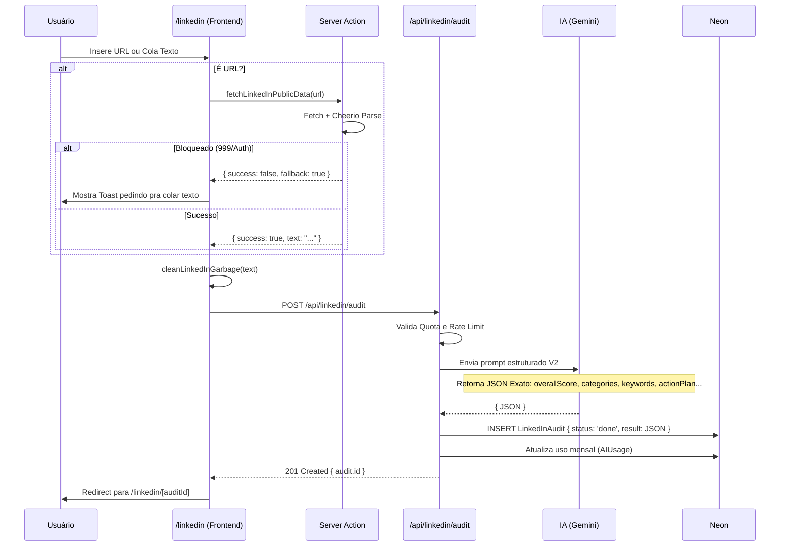

# Fluxo: Auditoria de LinkedIn

> Pipeline completo: input do usuário → extração direta ou limpeza de texto → análise IA Estruturada
> → dashboard premium de resultados. O **maior diferencial** do produto.

## Visão Geral

| Aspecto | Detalhe |
|---|---|
| **Feature gate** | Free (1/mês) / Pro (5/mês) / Anual (∞) |
| **Trigger** | Sidebar → "LinkedIn Audit" |
| **Latência total** | 10–20s (síncrono na edge/serverless) |
| **Custo IA** | ~US$ 0,005 por auditoria (Gemini Flash Lite) |
| **Schema DB** | `LinkedInAudit` |

## Diagrama de Fluxo


```mermaid
sequenceDiagram
    participant U as Usuário
    participant FE as /linkedin (Frontend)
    participant Act as Server Action
    participant API as /api/linkedin/audit
    participant AI as IA (Gemini)
    participant DB as Neon

    U->>FE: Insere URL ou Cola Texto
    alt É URL?
        FE->>Act: fetchLinkedInPublicData(url)
        Act->>Act: Fetch + Cheerio Parse
        alt Bloqueado (999/Auth)
            Act-->>FE: { success: false, fallback: true }
            FE->>U: Mostra Toast pedindo pra colar texto
        else Sucesso
            Act-->>FE: { success: true, text: "..." }
        end
    end
    
    FE->>FE: cleanLinkedInGarbage(text)
    
    FE->>API: POST /api/linkedin/audit
    API->>API: Valida Quota e Rate Limit
    
    API->>AI: Envia prompt estruturado V2
    Note over AI: Retorna JSON Exato: overallScore, categories, keywords, actionPlan...
    AI-->>API: { JSON }
    
    API->>DB: INSERT LinkedInAudit { status: 'done', result: JSON }
    API->>DB: Atualiza uso mensal (AIUsage)
    
    API-->>FE: 201 Created { audit.id }
    FE->>U: Redirect para /linkedin/[auditId]
```

## Tratamento de Dados de Entrada

### Camada 1: Server Action de URL
Um fetch simples com cabeçalhos disfarçados via `app/actions/linkedin.ts`.
- **Por que falha?** O LinkedIn possui anti-scraping extremamente agressivo que retorna HTTP 999.
- **O que fazemos?** Capturamos o código 999 ou 401 e retornamos à interface para fazer um *fallback elegante* sem quebrar o sistema, ativando a aba de "Colar Texto".

### Camada 2: Limpeza Automática Client-Side
- Para evitar enviar lixo gerado pelo `Ctrl+A` da página web do LinkedIn (menus redundantes, badges de notificações).
- O script remove strings exatas como "Messaging", "Me", "View dashboard".

## Estrutura do JSON do Relatório da IA

Diferente do V1 onde fazíamos parsing complexo e a IA respondia de forma mista, agora a **IA gera o Relatório Final Estruturado V2 diretamente**.

```ts
interface AuditResult {
  overallScore: number;
  executiveSummary: string;
  categories: Array<{
    id: 'ats' | 'seo' | 'personal_brand' | 'experience' | 'skills' | 'projects' | 'certifications' | 'general_quality';
    title: string;
    score: number;
    explanation: string;
    recommendations: string[];
  }>;
  keywords: {
    missing: string[];
    suggested: string[];
    matchWithTarget: string;
  };
  generatedContent: {
    headline: string;
    about: string;
    experienceImprovements: Array<{ companyOrRole: string; suggestion: string }>;
  };
  actionPlan: Array<{
    priority: 'high' | 'medium' | 'low';
    action: string;
    impact: string;
  }>;
  metrics: {
    charCount: number;
    wordCount: number;
    hasNumbers: boolean;
    hasLinks: boolean;
  };
}
```

## UI do Relatório Premium

O frontend em `/linkedin/[id]` utiliza o JSON gerado para renderizar uma página imersiva:
- **Score Header Imersivo:** Circular progress de alta resolução com animações CSS.
- **Plano de Ação:** Formatado visualmente para chamar a atenção para itens "high priority".
- **Cartões Individuais:** Layout em Grid dividindo o score entre ATS, Experiência, etc.
- **Framer Motion:** Animações sutis `animate-in fade-in` que carregam seções em cascata.

## Histórico de Auditorias
O painel em `/linkedin` exibe o histórico de auditorias feitas pelo usuário, puxando da tabela `LinkedInAudit`, mostrando a pontuação, área e a data, permitindo revisitar resultados antigos.

## Rate Limiting

| Plano | Limite | Chave Redis (Upstash) |
|---|:---:|---|
| Free | 1/mês | `ai:userId` |
| Pro Mensal | 5/mês | `ai:userId` |
| Pro Anual | ∞ | — |

*Nota: As verificações de cota utilizam as funções unificadas em `lib/plan.ts` e são compartilhadas com outras funções de IA do sistema.*
