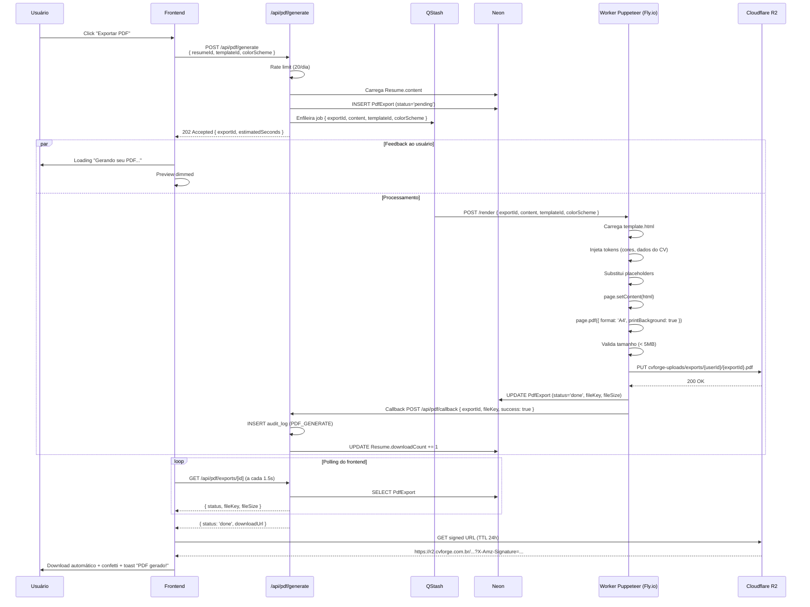

# Fluxo: Exportação de PDF

> Pipeline completo de geração de PDF: Puppeteer worker + fila assíncrona +
> upload para R2 + URL assinada.

## Visão Geral

| Aspecto | Detalhe |
|---|---|
| **Trigger** | Usuário clica "Exportar PDF" no editor ou dashboard |
| **Latência esperada** | 2–6s |
| **Custo por PDF** | ~R$ 0,01 (compute Fly.io) |
| **Output** | URL assinada no R2 (expira em 24h) |
| **Rate limit** | 20/dia por usuário Pro |

## Diagrama



## Arquitetura

```
┌──────────────────┐     ┌──────────────────┐     ┌──────────────────┐
│  Next.js API     │────▶│  Upstash QStash  │────▶│  Fly.io Worker   │
│  /api/pdf/       │     │  (fila)          │     │  (Puppeteer)     │
│  generate        │     │                  │     │                  │
└────────┬─────────┘     └──────────────────┘     └────────┬─────────┘
         │                                                  │
         │                                                  ▼
         │                                          ┌──────────────────┐
         │                                          │  Cloudflare R2   │
         │                                          │  (Storage)       │
         │                                          └──────────────────┘
         │
         ▼
┌──────────────────┐
│  Neon Postgres   │
│  (metadata)      │
└──────────────────┘
```

## API Route: `POST /api/pdf/generate`

```ts
// app/api/pdf/generate/route.ts
export async function POST(req: Request) {
  const session = await getServerSession();
  if (!session) return new Response('Unauthorized', { status: 401 });

  // 1. Rate limit
  const { success, remaining } = await ratelimit.pdf(session.user.id);
  if (!success) return new Response('Rate limit', { status: 429 });

  // 2. Parse body
  const { resumeId, templateId, colorScheme } = await req.json();

  // 3. Carrega currículo
  const resume = await prisma.resume.findFirst({
    where: { id: resumeId, userId: session.user.id },
  });
  if (!resume) return new Response('Not found', { status: 404 });

  // 4. Cria registro PdfExport
  const exportRecord = await prisma.pdfExport.create({
    data: {
      userId: session.user.id,
      resumeId,
      templateId: templateId || resume.templateId,
      colorScheme: colorScheme || resume.colorScheme,
      status: 'pending',
    },
  });

  // 5. Enfileira
  await qstash.publishJSON({
    url: `${env.PUPPETEER_WORKER_URL}/render`,
    body: {
      exportId: exportRecord.id,
      content: resume.content,
      templateId: exportRecord.templateId,
      colorScheme: exportRecord.colorScheme,
      watermark: session.user.plan === 'FREE',
    },
  });

  return Response.json({
    exportId: exportRecord.id,
    estimatedSeconds: 5,
  }, { status: 202 });
}
```

## Worker Puppeteer

```ts
// worker/src/index.ts (Fly.io)
import puppeteer from 'puppeteer';
import { S3Client, PutObjectCommand } from '@aws-sdk/client-s3';
import { renderTemplate } from './templates';

const s3 = new S3Client({ region: 'auto', endpoint: env.R2_ENDPOINT, ... });

const browser = await puppeteer.launch({
  headless: 'new',
  args: ['--no-sandbox', '--disable-setuid-sandbox'],
});

app.post('/render', async (req, res) => {
  const { exportId, content, templateId, colorScheme, watermark } = req.body;

  const html = renderTemplate(templateId, { content, colorScheme, watermark });

  const page = await browser.newPage();
  await page.setContent(html, { waitUntil: 'networkidle0' });
  await page.evaluateHandle('document.fonts.ready');

  const pdfBuffer = await page.pdf({
    format: 'A4',
    printBackground: true,
    margin: { top: '20mm', right: '20mm', bottom: '20mm', left: '20mm' },
  });

  await page.close();

  // Upload para R2
  const key = `exports/${req.userId}/${exportId}.pdf`;
  await s3.send(new PutObjectCommand({
    Bucket: env.R2_BUCKET,
    Key: key,
    Body: pdfBuffer,
    ContentType: 'application/pdf',
    ContentDisposition: `attachment; filename="curriculo.pdf"`,
  }));

  res.json({ exportId, success: true, fileKey: key, fileSize: pdfBuffer.length });
});
```

## Renderização do Template

```ts
// worker/src/templates/modern.ts
export function renderModern({ content, colorScheme, watermark }) {
  const color = colorTokens[colorScheme].primary;

  return `
    <!DOCTYPE html>
    <html>
    <head>
      <link rel="stylesheet" href="https://fonts.googleapis.com/css2?family=Inter:wght@400;600;700&display=swap">
      <style>${getStyles('modern', color)}</style>
    </head>
    <body>
      <div class="resume ${watermark ? 'with-watermark' : ''}">
        <header>
          <h1>${content.personal.name}</h1>
          <h2>${content.personal.jobTitle}</h2>
          <div class="contact">
            ${content.personal.email} · ${content.personal.phone} · ${content.personal.location}
          </div>
        </header>
        ${content.personal.summary ? `<section class="summary"><h3>Resumo</h3><p>${content.personal.summary}</p></section>` : ''}
        ${renderExperience(content.experience)}
        ${renderEducation(content.education)}
        ${renderSkills(content.skills)}
        ${content.projects.length > 0 ? renderProjects(content.projects) : ''}
      </div>
      ${watermark ? '<div class="watermark">ATRION Free</div>' : ''}
    </body>
    </html>
  `;
}
```

## Polling no Frontend

```tsx
// hooks/usePdfExport.ts
function usePdfExport() {
  const [status, setStatus] = useState<'idle' | 'pending' | 'done' | 'failed'>('idle');
  const [downloadUrl, setDownloadUrl] = useState<string | null>(null);

  const startExport = async (resumeId: string) => {
    setStatus('pending');
    const { exportId } = await fetch('/api/pdf/generate', {
      method: 'POST',
      body: JSON.stringify({ resumeId }),
    }).then(r => r.json());

    // Polling
    const poll = setInterval(async () => {
      const data = await fetch(`/api/pdf/exports/${exportId}`).then(r => r.json());
      if (data.status === 'done') {
        clearInterval(poll);
        setStatus('done');
        setDownloadUrl(data.downloadUrl);
        // Trigger download
        const a = document.createElement('a');
        a.href = data.downloadUrl;
        a.download = 'curriculo.pdf';
        a.click();
      } else if (data.status === 'failed') {
        clearInterval(poll);
        setStatus('failed');
      }
    }, 1500);

    // Timeout safety
    setTimeout(() => clearInterval(poll), 30000);
  };

  return { status, downloadUrl, startExport };
}
```

## Marca d'água (Free)

```css
.with-watermark {
  position: relative;
}

.watermark {
  position: fixed;
  top: 50%; left: 50%;
  transform: translate(-50%, -50%) rotate(-30deg);
  font-size: 100px;
  color: rgba(0, 0, 0, 0.08);
  font-weight: 800;
  pointer-events: none;
  z-index: 999;
  white-space: nowrap;
}
```

## Retry e Resiliência

| Falha | Comportamento |
|---|---|
| Worker offline (cold start) | QStash retenta 3x com backoff |
| Puppeteer timeout (> 30s) | Job cancelado + status `failed` no DB |
| PDF > 5MB | Worker rejeita + log + status `failed` |
| R2 indisponível | Retry 3x → callback com erro → status `failed` |
| PDF gerado OK mas callback falha | Worker retenta callback 3x |

## URL Assinada (Download)

```ts
import { getSignedUrl } from '@aws-sdk/s3-request-presigner';
import { GetObjectCommand } from '@aws-sdk/client-s3';

const url = await getSignedUrl(
  s3,
  new GetObjectCommand({ Bucket: env.R2_BUCKET, Key: fileKey }),
  { expiresIn: 86400 } // 24h
);
```

## Rate Limiting

| Plano | Limite | Reset |
|---|:---:|---|
| Free | 20/dia | Diário (UTC) |
| Pro | 20/dia | Diário |
| Pro Anual | 20/dia | Diário |

> Limite pode subir no V2+ (por exemplo, Pro Anual 50/dia).

## Métricas

| Métrica | Meta |
|---|:---:|
| Latência média de geração | < 6s |
| Taxa de sucesso (jobs) | > 98% |
| % de currículos com ≥ 1 PDF gerado | > 70% |
| % de Pro que exportam PDF semanalmente | > 80% |
