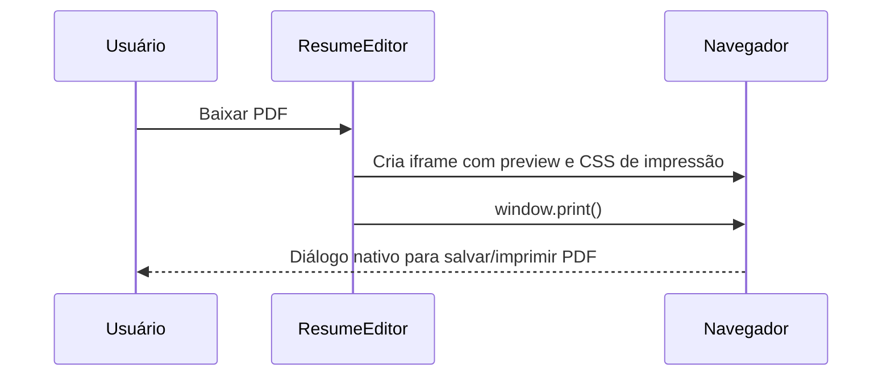

# Exportação de PDF

A exportação atual não envia o currículo a um worker. O editor clona o preview em um iframe, aplica estilos de impressão A4 e chama `window.print()`.

```mermaid
sequenceDiagram
  participant U as Usuário
  participant E as ResumeEditor
  participant B as Navegador
  U->>E: Baixar PDF
  E->>B: Cria iframe com preview e CSS de impressão
  E->>B: window.print()
  B-->>U: Diálogo nativo para salvar/imprimir PDF
```

O resultado depende do navegador e da impressora virtual escolhida pelo usuário. Não há histórico de exports nem arquivo PDF salvo no R2.