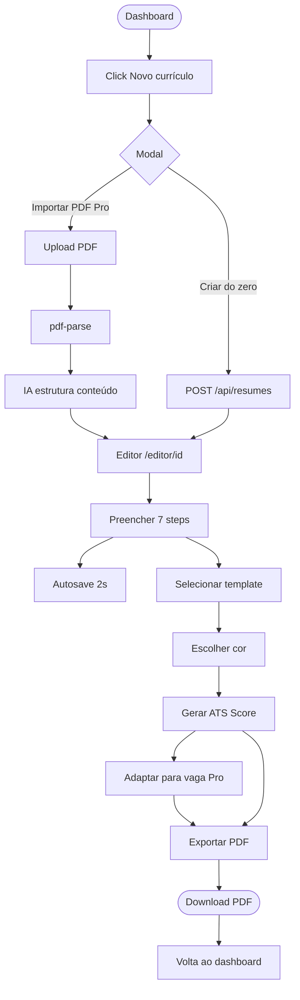
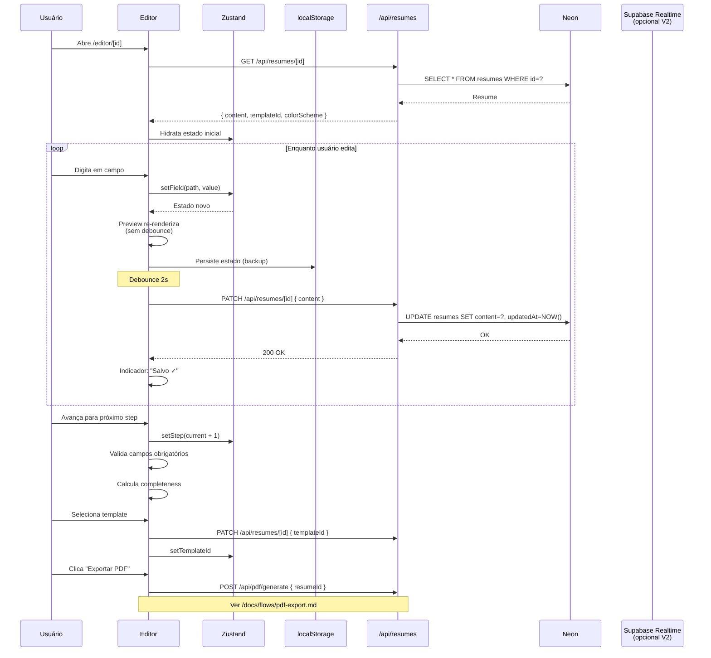
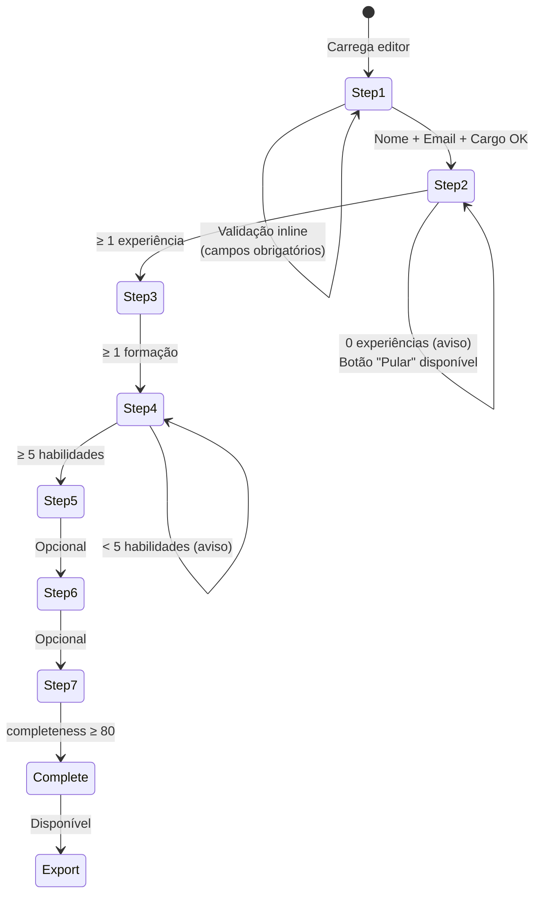
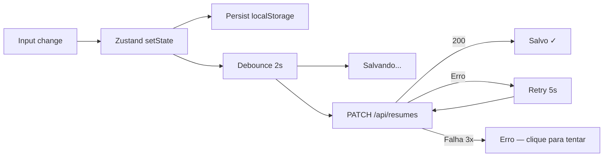

# Fluxo: Criação de Currículo do Zero

> O fluxo principal do produto: usuário cria, edita, preenche, escolhe template
> e exporta o currículo.

## Diagrama Macro



## Diagrama Detalhado (Editor)



## Estados da Validação



## Comportamento do Autosave



**Indicador visual (canto superior direito):**

| Estado | Ícone | Cor | Duração |
|---|---|---|---|
| `idle` | Nuvem | Cinza | Até próxima mudança |
| `saving` | Spinner | Azul | ~500ms típico |
| `saved` | Checkmark | Verde | 2s, depois volta a `idle` |
| `error` | X | Vermelho | Até usuário clicar para retry |

## Lógica do Completeness

```ts
function calculateCompleteness(content: ResumeContent): number {
  let score = 0;
  const { personal, experience, education, skills, projects, languages, certifications } = content;

  if (personal.name) score += 5;
  if (personal.email) score += 5;
  if (personal.jobTitle) score += 5;
  if (personal.summary && personal.summary.length >= 50) score += 10;
  if (experience.length >= 1) score += 15;
  if (education.length >= 1) score += 10;
  if (skills.length >= 5) score += 10;
  if (projects.length >= 1) score += 5;
  if (languages.length >= 1) score += 5;
  if (personal.photoUrl) score += 5;
  if (personal.linkedin) score += 5;
  if (personal.phone) score += 5;
  if (personal.website || personal.github) score += 5;
  if (certifications.length >= 1) score += 5;
  if (personal.summary && personal.summary.length >= 200) score += 5;

  return Math.min(score, 100);
}
```

## Preview em Tempo Real

- Renderizado no painel direito (desktop) ou em modal (mobile)
- Atualiza a **cada keystroke** (sem debounce — performance vem do React)
- Troca de template/cor também atualiza instantaneamente

## Sugestões da IA no Editor

| Step | IA Disponível | Feature Gate |
|---|---|---|
| 1 — Pessoal | "Sugerir resumo" | Pro |
| 2 — Experiência | "Sugerir verbos e métricas" | Pro |
| 3 — Formação | "Destacar cursos relevantes" | Pro |
| 4 — Habilidades | "Sugerir habilidades faltantes" | Pro |
| 5 — Projetos | "Reformular descrição" | Pro |
| 7 — Certificações | "Listar certificações valorizadas" | Pro |

> Free vê os botões desabilitados com tooltip "Pro".

## Transição entre Steps

```ts
// Validação por step
const stepValidations = {
  1: (c) => c.personal.name && c.personal.email && c.personal.jobTitle,
  2: (c) => c.experience.length >= 1, // ou permitir skip
  3: (c) => c.education.length >= 1,
  4: (c) => c.skills.length >= 5,
  5: () => true, // opcional
  6: () => true, // opcional
  7: () => true, // opcional
};

function canAdvance(currentStep: number, content: ResumeContent): boolean {
  if (currentStep === 2) {
    return stepValidations[2](content) || confirm('Pular sem experiência?');
  }
  return stepValidations[currentStep]?.(content) ?? true;
}
```

## Confirmação ao Sair

Se há mudanças não salvas (indicador ainda em "Salvando..."):

```ts
useEffect(() => {
  const handler = (e: BeforeUnloadEvent) => {
    if (saveStatus === 'saving') {
      e.preventDefault();
      e.returnValue = '';
    }
  };
  window.addEventListener('beforeunload', handler);
  return () => window.removeEventListener('beforeunload', handler);
}, [saveStatus]);
```

## Métricas

| Métrica | Meta |
|---|:---:|
| % de cadastros que criam ≥ 1 CV | > 80% |
| Tempo médio para completeness 80 | < 12min |
| % de CVs que atingem completeness 100 | > 40% |
| Taxa de uso do autosave (vs save manual) | > 95% |

## Edge Cases

| Situação | Tratamento |
|---|---|
| Conteúdo corrompido no localStorage | Fallback para estado do servidor |
| 2 abas abertas editando mesmo CV | `If-Match: etag` → 412 se conflito |
| Foto > 2MB | Rejeitar antes do upload |
| Resumo > 2000 chars | Avisar + oferecer truncar |
| Step sem campos obrigatórios | Botão "Pular" + aviso visual |
| Sessão expirada durante edição | Tentar refresh; se falhar, salvar no LS e pedir login |
| Rede instável | Retry exponencial até 3x, depois erro visual + opção de continuar offline |
