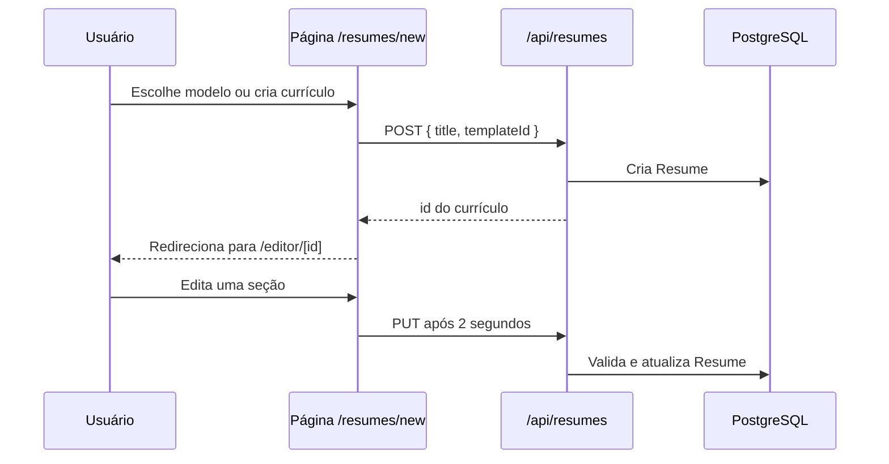

# Criação e importação de currículo

```mermaid
sequenceDiagram
  participant U as Usuário
  participant P as Página /resumes/new
  participant API as /api/resumes
  participant D as PostgreSQL
  U->>P: Escolhe modelo ou cria currículo
  P->>API: POST { title, templateId }
  API->>D: Cria Resume
  API-->>P: id do currículo
  P-->>U: Redireciona para /editor/[id]
  U->>P: Edita uma seção
  P->>API: PUT após 2 segundos
  API->>D: Valida e atualiza Resume
```

Para importação, o usuário envia PDF ou DOCX para `POST /api/resumes/import`. O servidor extrai texto e usa IA para produzir `ResumeContent`; o usuário deve revisar o resultado no editor.