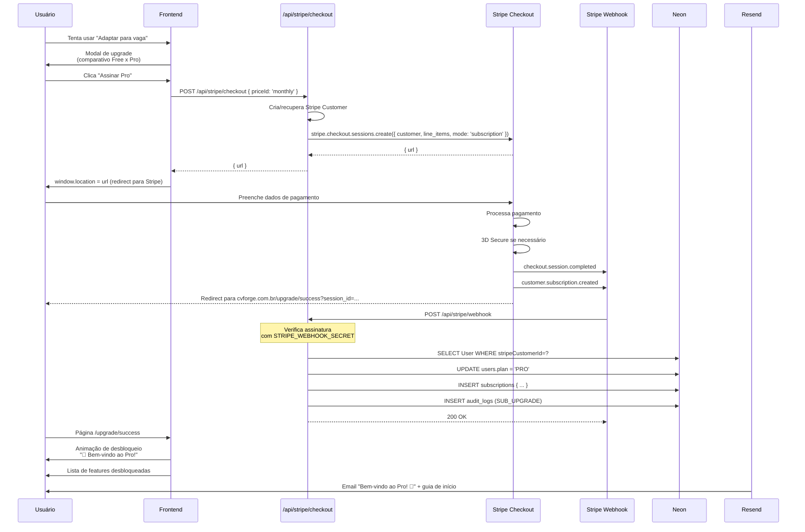
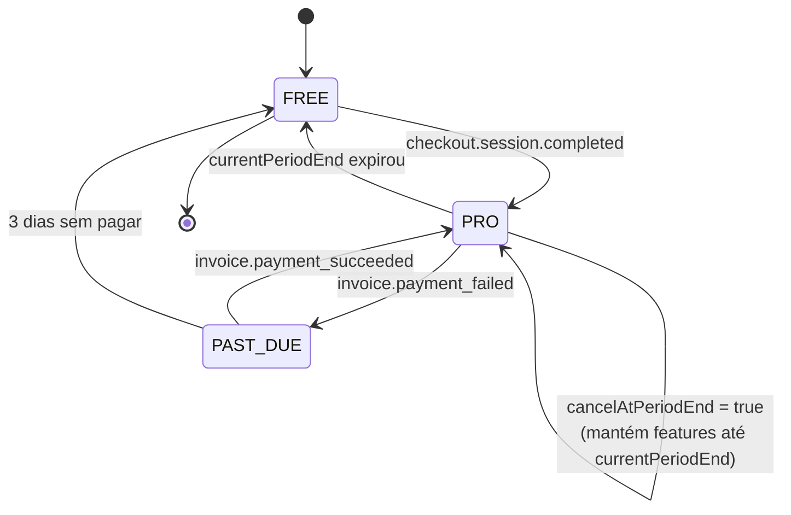

# Fluxo: Upgrade Free → Pro

> Do momento em que o usuário tenta acessar uma feature Pro até a confirmação
> do pagamento e desbloqueio de funcionalidades.

## Visão Geral

| Aspecto | Detalhe |
|---|---|
| **Trigger** | Click em feature Pro (ATS por vaga, adaptação, 4ª auditoria, etc.) |
| **Latência** | 30s (checkout Stripe) + 5s (webhook) |
| **Cancelamento** | Auto-serviço via Customer Portal |

## Diagrama



## Modal de Upgrade (Gate)

Aparece quando usuário Free tenta usar feature Pro:

```
┌────────────────────────────────────────────────────────────┐
│  ✨ Desbloqueie esta e outras features Pro                 │
│                                                            │
│  "Adaptar currículo para cada vaga aumenta suas chances   │
│   em até 3x nos filtros ATS."                              │
│                                                            │
│  ┌────────────────┬────────────────┬────────────────┐      │
│  │      Free      │   Pro Mensal   │   Pro Anual    │      │
│  │      R$ 0      │   R$ 29/mês    │  R$ 197/ano    │      │
│  │                │                │ (32% off)      │      │
│  │ 3 currículos   │ Ilimitado      │ Ilimitado      │      │
│  │ 3 templates    │ Todos (10+)    │ Todos (10+)    │      │
│  │ ATS Score 3x   │ Ilimitado      │ Ilimitado      │      │
│  │ 1 auditoria/mês│ 5 auditorias/mês│ Ilimitado    │      │
│  │ Sem adaptação  │ 20x adaptação  │ Ilimitado      │      │
│  │ Sem link público│ Link público  │ Link público   │      │
│  └────────────────┴────────────────┴────────────────┘      │
│                                                            │
│  💡 75% dos usuários Pro conseguem entrevistas em 30 dias   │
│                                                            │
│  [Continuar Free]      [🚀 Assinar Pro Mensal]   [Anual]  │
└────────────────────────────────────────────────────────────┘
```

## Página de Sucesso

```
┌────────────────────────────────────────────────────────────┐
│                                                            │
│                          🎉                                │
│                                                            │
│               Bem-vindo ao ATRION Pro!                    │
│                                                            │
│      Agora você tem acesso ilimitado a todas as            │
│      features de IA. Vamos começar?                        │
│                                                            │
│  ✨ Funcionalidades desbloqueadas:                          │
│  • ATS Score ilimitado (geral + por vaga)                  │
│  • Adaptação de currículo para qualquer vaga               │
│  • Todos os 10 templates premium                           │
│  • 5 auditorias LinkedIn por mês                           │
│  • Link público do seu currículo                          │
│  • Carta de apresentação e simulador de recrutador         │
│                                                            │
│  [📝 Criar currículo]  [🎯 Adaptar para uma vaga agora]   │
│                                                            │
│  Enviamos um email com dicas de como aproveitar o Pro.     │
└────────────────────────────────────────────────────────────┘
```

## Customer Portal (Cancelamento, atualização)

**Tela:** `/profile/billing`

Usuários podem:
- Ver próxima cobrança
- Atualizar cartão
- Cancelar assinatura (mantém até fim do período)
- Reativar assinatura cancelada
- Baixar faturas
- Trocar entre mensal e anual

```ts
// app/api/stripe/portal/route.ts
export async function POST() {
  const session = await getServerSession();
  if (!session?.user.stripeCustomerId) {
    return new Response('No subscription', { status: 404 });
  }

  const portalSession = await stripe.billingPortal.sessions.create({
    customer: session.user.stripeCustomerId,
    return_url: `${env.APP_URL}/profile/billing`,
  });

  return Response.json({ url: portalSession.url });
}
```

## Webhook Handler

```ts
// app/api/stripe/webhook/route.ts
export async function POST(req: Request) {
  const signature = req.headers.get('stripe-signature');
  if (!signature) return new Response('No signature', { status: 400 });

  const body = await req.text();
  let event: Stripe.Event;

  try {
    event = stripe.webhooks.constructEvent(body, signature, env.STRIPE_WEBHOOK_SECRET);
  } catch (err) {
    return new Response('Invalid signature', { status: 400 });
  }

  // Idempotência
  const existing = await prisma.webhookEvent.findUnique({ where: { id: event.id } });
  if (existing) return new Response('Already processed', { status: 200 });
  await prisma.webhookEvent.create({ data: { id: event.id, type: event.type } });

  switch (event.type) {
    case 'checkout.session.completed':
    case 'customer.subscription.created':
    case 'customer.subscription.updated':
      await handleSubscriptionUpdate(event.data.object as Stripe.Subscription);
      break;

    case 'customer.subscription.deleted':
      await handleSubscriptionCanceled(event.data.object as Stripe.Subscription);
      break;

    case 'invoice.payment_failed':
      await handlePaymentFailed(event.data.object as Stripe.Invoice);
      break;

    case 'invoice.payment_succeeded':
      await handlePaymentSucceeded(event.data.object as Stripe.Invoice);
      break;
  }

  return new Response('OK', { status: 200 });
}
```

## Migração de Status do Plano



## Email Pós-Upgrade

Template: `emails/subscription-welcome.tsx`

**Assunto:** "Bem-vindo ao ATRION Pro! 🚀"

**Conteúdo:**
- Hero com check
- "Agora você pode..."
- 5 quick wins para testar:
  1. Adaptar currículo para uma vaga real
  2. Auditar seu LinkedIn
  3. Baixar PDF sem marca d'água
  4. Gerar uma carta de apresentação
  5. Tornar seu currículo público
- Link para suporte prioritário

## Métricas

| Métrica | Meta V1 | Meta V3 |
|---|:---:|:---:|
| Conversão Free → Pro | > 2% | > 5% |
| Conversão Pro Mensal → Anual | > 25% | > 35% |
| Tempo até primeiro upgrade | < 14d | < 7d |
| LTV médio Pro | R$ 120 | R$ 260 |
| Churn mensal | < 15% | < 6% |

## Edge Cases

| Situação | Tratamento |
|---|---|
| Pagamento recusado | Email + banner no app por 3 dias, depois downgrade |
| Webhook chega antes do redirect | Usuário já vê Pro no dashboard |
| Webhook atrasado (> 5min) | Polling no `/upgrade/success` verifica status |
| Usuário cancela imediatamente | Mantém Pro até fim do período + email "Sentimos sua falta" |
| Stripe outage | Webhook retenta automaticamente |
| Disputa/chargeback | Marca conta com flag, suspende Pro features |
| Usuário Pro faz downgrade | Features Pro desabilitam no fim do período, não imediatamente |
