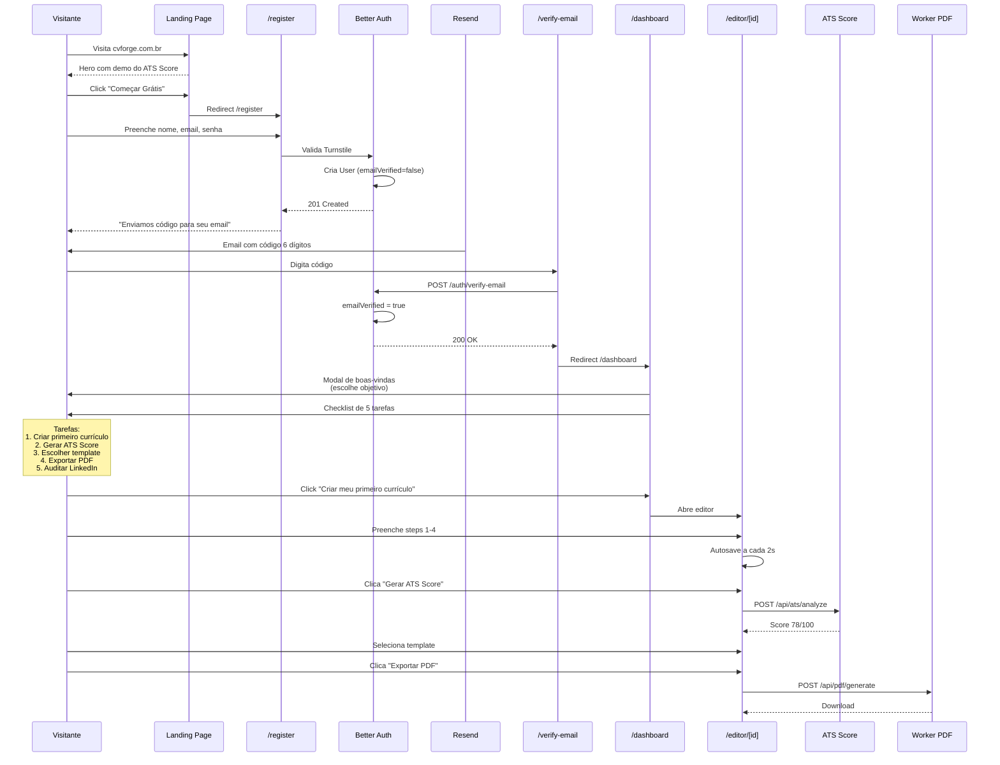

# Fluxo: Onboarding (Primeiro Acesso)

> Da landing page ao primeiro currículo criado. Foco em **ativação** com
> checklist de 5 tarefas (V2).

## Visão Geral

| Etapa | Tela | Tempo esperado | Métrica de sucesso |
|---|---|---|---|
| 1. Landing | `/` | 30s | Click no CTA |
| 2. Cadastro | `/register` | 60s | Conta criada |
| 3. Verificação email | `/verify-email` | 30s | `emailVerified = true` |
| 4. Modal de boas-vindas | Modal | 10s | Escolha de objetivo |
| 5. Dashboard | `/dashboard` | — | Vê o dashboard vazio |
| 6. Checklist de ativação | Sidebar | 5min | ≥ 3 tarefas concluídas |
| 7. Primeiro currículo | `/editor/[id]` | 10–15min | `completeness ≥ 80` |
| 8. Primeiro PDF | `/dashboard` | 30s | PDF baixado |

## Diagrama



## Detalhamento das Etapas

### 1. Landing Page

**Objetivo:** converter visitante em signup.

**Componentes principais:**
- Hero com demo animada do ATS Score (gauge 0 → 87)
- Comparativo: "Por que ATRION vs Zety, Canva, Resume.io"
- Pricing (Free vs Pro)
- Depoimentos placeholder (substituir por reais após V1.1)
- CTA duplo: "Começar Grátis" + "Ver demo"

**CTAs:**
- Header: "Login" / "Começar Grátis"
- Hero: "Criar meu primeiro currículo"
- Pricing: "Assinar Pro" (por plano)
- Footer: "Login" / "Cadastro"

### 2. Cadastro

**Tela:** `/register`

**Campos:**
- Nome (mín 2 chars)
- Email (validado + unicidade)
- Senha (≥ 8 chars, ≥ 1 maiúscula, ≥ 1 número)
- Checkbox: "Aceito os Termos de Uso" (obrigatório, link)
- Checkbox: "Quero receber dicas de carreira" (opcional, separado)
- Cloudflare Turnstile (invisível)

**Após submit bem-sucedido:**
- Redireciona para `/verify-email`
- Toast: "Conta criada! Verifique seu email."
- Email enviado via Resend com código de 6 dígitos (TTL 15min)

### 3. Verificação de Email

**Tela:** `/verify-email?email=...`

**Input:** código de 6 dígitos (input numérico com auto-advance entre boxes)

**Estados:**
- Vazio: "Digite o código enviado para seu@email.com"
- Erro: "Código inválido ou expirado" + botão "Reenviar código"
- Sucesso: redirect para `/dashboard` com toast de boas-vindas

**Tratamento:**
- 5 tentativas erradas → rate limit (15min)
- Reenvio disponível a cada 30s
- Não verificado em 24h → conta removida

### 4. Modal de Boas-Vindas

**Aparece 1x** no primeiro acesso ao dashboard.

**Conteúdo:**
```
┌──────────────────────────────────────────────┐
│  👋 Bem-vindo ao ATRION!                    │
│                                              │
│  Qual seu objetivo principal?                │
│  ( ) Estou procurando emprego agora          │
│  (●) Quero melhorar meu currículo            │
│  ( ) Quero otimizar meu LinkedIn             │
│  ( ) Só explorando                           │
│                                              │
│  Isso nos ajuda a personalizar a experiência.│
│                                              │
│                    [Pular]  [Continuar →]    │
└──────────────────────────────────────────────┘
```

**Com base na resposta:**
- "Procurando emprego" → tutorial focado em ATS Score + adaptação
- "Melhorar CV" → tutorial de criação + templates
- "Otimizar LinkedIn" → tutorial de auditoria
- "Explorando" → checklist genérico

### 5. Dashboard Vazio

**Tela:** `/dashboard`

```
┌──────────────────────────────────────────────────────┐
│  Meus Currículos                  [+ Novo currículo] │
├──────────────────────────────────────────────────────┤
│                                                      │
│           🎨 Você ainda não tem currículos           │
│                                                      │
│      Crie seu primeiro currículo profissional       │
│            em menos de 10 minutos.                   │
│                                                      │
│              [+ Criar meu primeiro currículo]        │
│                                                      │
│      ── ou ──                                        │
│                                                      │
│      [📤 Importar PDF existente] (Pro)               │
│                                                      │
└──────────────────────────────────────────────────────┘
```

### 6. Checklist de Ativação (V2)

**Sidebar ou banner superior** com 5 tarefas:

| # | Tarefa | Como concluir | Recompensa visual |
|---|---|---|---|
| 1 | Criar primeiro currículo | Abrir editor | Confetti |
| 2 | Completar 80% do CV | Atingir completeness ≥ 80 | Badge |
| 3 | Gerar ATS Score | Clicar botão ATS | Gauge animado |
| 4 | Exportar primeiro PDF | Baixar PDF | Toast |
| 5 | Auditar LinkedIn | Concluir auditoria | Score LinkedIn |

**Comportamento:**
- Dismissable individualmente
- Esconde automaticamente quando todas concluídas
- Não bloqueante (usuário pode fazer o que quiser)

## Métricas de Onboarding

| Métrica | Meta V1 | Meta V3 |
|---|:---:|:---:|
| Visitantes → Cadastros | > 5% | > 12% |
| Cadastros → email verificado | > 70% | > 85% |
| Verificados → primeiro CV criado | > 60% | > 80% |
| Verificados → primeiro PDF | > 30% | > 55% |
| Tempo até primeiro PDF | < 15min | < 10min |

## Edge Cases

| Situação | Tratamento |
|---|---|
| Email já cadastrado | "Email já registrado. Faça login ou recupere a senha" |
| Email inválido (bounce) | Marca email como inválido, pede novo |
| Usuário não verifica em 24h | Email de lembrete → após 7d, conta removida |
| Login com OAuth após cadastro email | Mesma conta é mergeada (Better Auth gerencia) |
| Sessão expirada durante onboarding | Refresh automático; se falhar, volta pro login com state preservado |
| Usuário pula onboarding | Pode retomar pelo menu (?tour=restart) |
