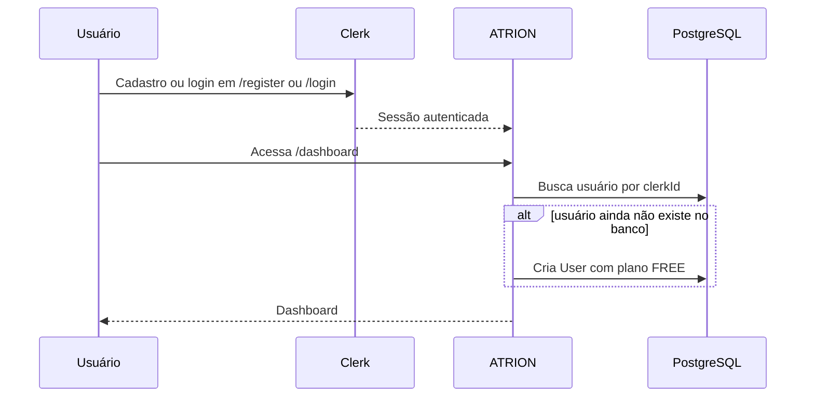

# Primeiro acesso

```mermaid
sequenceDiagram
  participant U as Usuário
  participant C as Clerk
  participant A as ATRION
  participant D as PostgreSQL
  U->>C: Cadastro ou login em /register ou /login
  C-->>A: Sessão autenticada
  U->>A: Acessa /dashboard
  A->>D: Busca usuário por clerkId
  alt usuário ainda não existe no banco
    A->>D: Cria User com plano FREE
  end
  A-->>U: Dashboard
```

A sincronização ocorre sob demanda em `getCurrentUser()`. Não há um webhook Clerk dedicado no repositório atual.